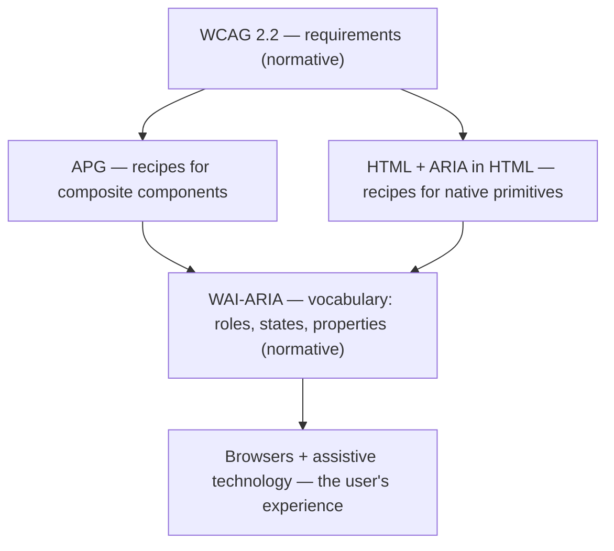
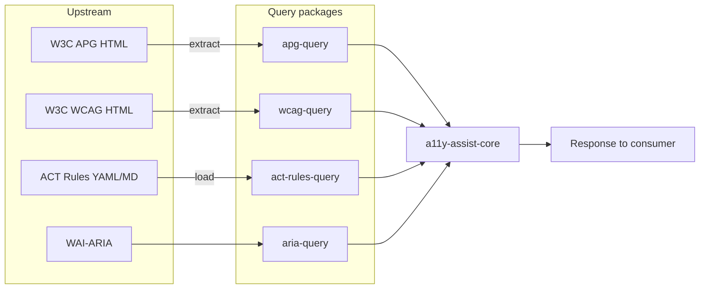

# Architecture

How a11y-assist is put together: the accessibility model it encodes, the sources it draws from, and the discipline that keeps every claim traceable. For setup, see [For agents]({{ '/agents/' | relative_url }}); for the tools, the [a11y-assist-mcp package]({{ '/packages/a11y-assist-mcp/' | relative_url }}).

## Principle

a11y-assist aggregates published guidance rather than authoring it. Every claim is derivable from a versioned upstream source. There is no paraphrased "best practice" content, and no editorial role-to-criterion or role-to-rule mapping that could diverge from the specifications.

Where W3C documents the content — APG patterns, WCAG Success Criteria, Techniques, Failures, ACT rules, the WAI-ARIA spec — a11y-assist extracts it verbatim into query packages. The system composes these sources at request time and hands the agent verbatim data plus *queries to run next*; the LLM agent does the synthesis (recommendations, code, fixes) by reasoning over the structured inputs. The one mechanical cross-corpus link is **ACT rule → WCAG SC**, taken straight from ACT front-matter.

## The accessibility model

Web accessibility is a layered system. Each layer has a clear authority and scope.



Each layer enables the one above: HTML + ARIA give you the words; APG shows how to compose them into working components; WCAG is the standard that says whether the result is acceptable; assistive technology is what users actually experience. The whole stack exists to serve that last layer.

The recipe layer (APG / HTML primitives) splits in two because APG only covers *custom or composite* components. For native primitives — text inputs, links, images — there is no APG pattern; the answer is "use the right HTML element," governed by the HTML spec and [ARIA in HTML](https://www.w3.org/TR/html-aria/). A real product uses both halves.

### The W3C sources, and how each is used

| Source | Authority | Role | Access |
|---|---|---|---|
| **WCAG 2.2** | Normative | The requirements: Success Criteria + Sufficient Techniques + documented Failures | [`wcag-query`](/a11y-assist/packages/wcag-query/) |
| **WAI-ARIA** | Normative | The vocabulary: roles, states, properties | [`aria-query`](https://www.npmjs.com/package/aria-query) (npm) |
| **APG** | Informative | Recipes for custom / composite components | [`apg-query`](/a11y-assist/packages/apg-query/) |
| **ARIA in HTML** | Normative | Maps native HTML elements to implicit ARIA roles | via `aria-query`'s element/role maps |
| **ACT Rules** | Informative | Conformance tests; each maps to the WCAG SCs it covers | [`act-rules-query`](/a11y-assist/packages/act-rules-query/) |

APG and ARIA-in-HTML sit at the same conceptual altitude — APG for custom components, HTML primitives for native ones. The decision tree: is there a native element? Use it. Augmenting one? Apply the matching APG pattern. Building from scratch? Use the APG pattern plus ARIA roles and keyboard handling. Nothing fits? It's novel — combine primitives and apply WCAG general principles, and expect heavier manual testing.

> **Platform scope.** Today a11y-assist is **web only**. React Native is a reserved future recipe surface (a peer to APG, sourced from RN docs) — see [For agents](/a11y-assist/agents/). It is not implemented; nothing in the current system asserts RN guidance.

## The pipeline



Each query package owns exactly one upstream source. `a11y-assist-core` knows nothing about scraping HTML or parsing YAML — it imports `getPattern`, `getSC`, `search`, etc. and composes them, with **no data of its own**.

The composition does not assert "which SCs apply." Instead:

1. **Entry** — `composeApgPattern(name, level)` (composite components) or `composeAriaRole(role, level)` (native primitives). Each returns the verbatim recipe + the ARIA contract for its roles + the native HTML elements that carry them (all mechanical) + `suggested_queries`.
2. **`suggested_queries`** are derived deterministically from the entry's structured fields and seed two paths, each stamped with the conformance `level`: `search_act` seeds (role names, required ARIA props, native element tags, a focus/keyboard seed when a keyboard table exists) and `search_wcag` seeds (role names, a keyboard/focus seed, a name/label seed when the role requires an accessible name). The second path reaches WCAG directly, so the drill-down is never empty for components ACT's sparser text index would miss.
3. **Drill-down** — the agent runs a suggested query. `searchAct(query, level)` returns ACT rules whose covered WCAG SCs are gated to the level (the one mechanical ACT→SC bridge); `searchWcag(query, level)` returns matching criteria directly. Either way, `getWcagSc(id)` then expands a criterion into techniques + failures, and `actRulesForSc(id)` walks the same ACT→SC link in reverse (the rules that cover a given criterion).

The level gate (`A`/`AA`/`AAA`, cumulative) is the only place `a11y-assist-core` joins ACT to WCAG levels, because the extractor packages stay single-source. The same query functions (`searchWcag`, `getWcagSc`, `searchAct`, `getActRule`, `actRulesForSc`, …) are the read surface both the MCP server and the website call, so the two consumers cannot drift. See [For agents](/a11y-assist/agents/) for the full tool surface and workflow.

## Snapshot discipline

Each query package commits its raw upstream HTML/YAML to `snapshots/`. Re-running the extractor against a committed snapshot produces byte-identical output to what's in `src/data/`. This gives:

- **Reproducibility** — anyone with the snapshot can re-derive the data.
- **Auditability** — a reviewer can diff snapshot against extracted JSON to verify the extractor introduces no errors.
- **Versioning** — the snapshot date is part of the package's identity and is surfaced in every response's `provenance`.

Refreshing against current upstream re-fetches the page, overwrites the snapshot, and re-runs extraction; the result is a reviewable git diff. **Updating snapshots is a deliberate, reviewed action — never automatic.**

```sh
npm run extract --workspace=apg-query -- --refresh
npm run extract --workspace=wcag-query -- --refresh
```

## Editorial content

`a11y-assist-core` contains no hand-maintained applicability data and ships no data of its own: every field is verbatim from a query package or `aria-query`, mechanically derived from one (the ARIA contract, native elements), or a `search_act` / `search_wcag` query. Which Success Criteria apply to a component is determined by the agent through those searches and the ACT-rule-to-Success-Criterion mapping, not by an editorial table.

This has a known limitation: ACT publishes no rules for several visual or perceptual Success Criteria (contrast `1.4.3`, target size `2.5.5`/`2.5.8`, focus appearance `2.4.7`, focus order `2.4.3`), so `search_act` does not surface them. The `search_wcag` path recovers some by matching the criteria directly; the rest are covered by axe-core at verification (contrast, target size) and by human review. None are asserted per pattern.

Search is heuristic, and it can dead-end. A separate, exploratory line of work — the [Classifier (WIP)](/a11y-assist/classifier/) — investigates a deterministic alternative: encoding each criterion's *applicability conditions* as boolean predicate expressions, so the criteria that apply to a component can be computed rather than searched. It is not yet wired into the system.

## Limitations of automated checks

Automated tooling covers approximately half of WCAG. A passing audit indicates "no automated violations found," not conformance. The following require human review:

- **Manual screen reader review** — NVDA, JAWS, VoiceOver, TalkBack interpret the same code differently.
- **Manual keyboard review** — every interaction reachable, focus order matches visual order, focus always visible, no traps.
- **Cognitive review** — clear language, predictable behaviour, error recovery, no reliance on colour or shape alone.
- **ACT's blind spot** (contrast, target size, focus appearance/order) — caught by axe at verification, not asserted per pattern.
- **React Native** — not implemented (web only).

## Contributing data

**Add an APG pattern:** add an entry to `apg-query/tools/extract.ts`'s pattern list → `npm run extract --workspace=apg-query` (fetches, snapshots, writes data) → commit snapshot + data. No bindings to maintain — the compose layer derives the ARIA contract, native elements, and drill-down seeds mechanically.

**Add a WCAG SC:** add an entry to `wcag-query/tools/extract.ts`'s SC list → `npm run extract --workspace=wcag-query` → commit snapshot + data.

**Refresh ACT rules:** copy the upstream `_rules/*.md` into `act-rules-query/snapshots/_rules/` → `npm run load --workspace=act-rules-query` (records the upstream commit hash) → diff-review and commit.

When upstream HTML structure shifts, the extractor may need updating; the `WARN: <pattern> has empty <field>` messages are the early signal. Pull a fresh snapshot, diff the output, fix the extractor, re-run until the diff is clean.
