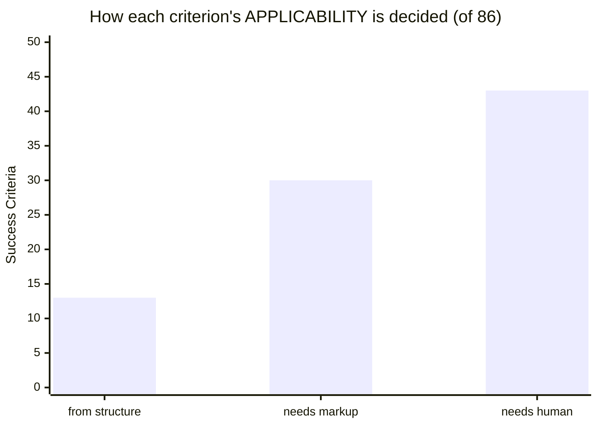
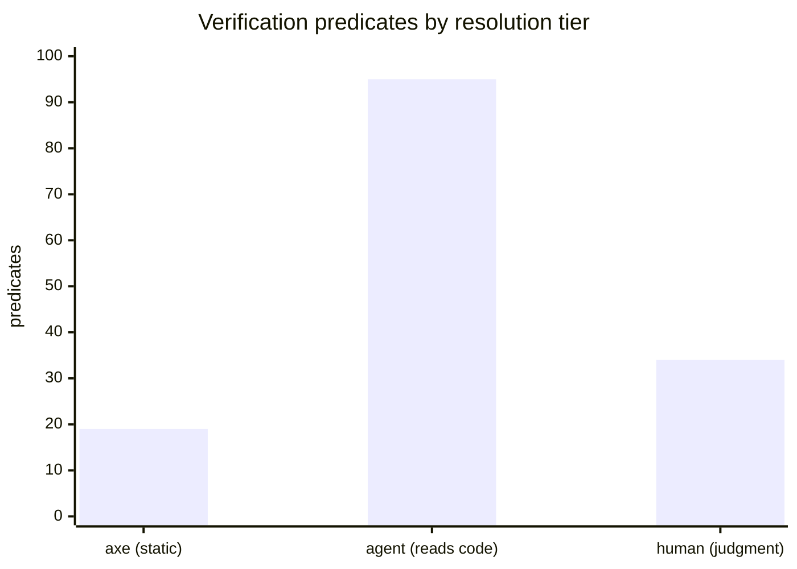

# Automation assessment

The predicate decomposition was built to *route* checks across tooling, agents, and people. As a byproduct it **quantifies how much of WCAG automated tooling can actually settle** — and the picture is sharper, and more sobering, than the usual "automated tools catch about half." All figures are derived from the data on the [Predicates]({{ '/classifier/predicates/' | relative_url }}) page.

## Judgment is needed *upstream* of verification

The standard framing — "tools catch ~50%, the rest is manual" — is entirely about *verifying*. The decomposition exposes an earlier, usually-ignored cost: judgment is needed just to decide **whether a criterion applies at all**.

**43 of 86** criteria need human judgment *even to scope whether they apply*. Automated tools hide this by silently treating "not detected" as "not applicable" — they never raise the question. Only **13** can be scoped from component structure alone.

## axe's real reach is ~12%, not ~50%

Counting *complete discharge of an obligation* rather than criteria axe merely touches:

| Measure | Value |
|---|---|
| WCAG criteria axe *touches* | 28 / 86 |
| WCAG criteria axe *fully closes* | **10 / 86** (~12%) |
| Verification predicates axe covers | 19 / 148 |

The "~50%" figure counts criteria a tool *touches* or *partially* addresses. By complete discharge, axe settles **10** of 86. The gap between "touches 28" and "closes 10" is the point: most obligations decompose into one axe-checkable property plus several that are not — so a passing scan is *necessary but weakly sufficient*, and silent about the rest.

## Three tiers: where verification actually lands

Each verification predicate, tagged by how it is resolved after the build (matched against axe-core's real 104-rule set):

Rolled up per criterion — what is required to fully verify each obligation:

| After the build… | SCs | Share |
|---|---|---|
| **axe alone** closes it | 10 | 12% |
| **axe + agent** close it (no user) | 45 | 52% |
| **user input** required | 31 | 36% |

The striking number is the **agent tier (95 predicates)** — larger than axe and human combined. Historically a11y verification was binary: a small automated slice vs. everything-else-is-manual. A reasoning agent creates a genuine **third tier** — not statically checkable, but decidable by reading the built code. After axe **and** agent, only **31 of 86** criteria still need a person. The real shift this documents is the locus of automation moving from rule-engines to reasoning-agents.

## Why static analysis hits a wall — and it is categorical

Static analysis is not weak here because axe is under-built. A large share of predicates are **about meaning** — uncheckable by any static analyzer *in principle*, because they need a model of intent, equivalence, and audience. Examples (the most reused human-tier postconditions):

| Postcondition | Criteria |
|---|---|
| `alternative-for-time-based-media-provided` | 1.2.1, 1.2.3, 1.2.8, 1.2.9 |
| `describes-topic-or-purpose` | 1.1.1, 2.4.2, 2.4.6 |
| `audio-description-provided` | 1.2.3, 1.2.5 |
| `link-purpose-determinable` | 2.4.4, 2.4.9 |
| `text-presentation-essential` | 1.4.5, 1.4.9 |
| `auto-updating-essential-to-activity` | 2.2.2 |
| `background-sounds-at-least-20db-lower-than-foreground` | 1.4.7 |
| `captcha-text-alternative-describes-purpose` | 1.1.1 |

No roadmap of "better static rules" closes this. The [reducibility analysis]({{ '/classifier/predicates/#reducibility' | relative_url }}) confirms the shape: WCAG is wide, shallow, and ~85% bespoke — written for human auditors exercising judgment, not for engines.

## Caveats — held honestly

- **The agent tier is a hypothesis, not a measurement.** We *tagged* 95 predicates "an agent could decide this." We have not shown an agent discharges them *reliably*. An agent can be confidently wrong about meaning, can miss runtime / assistive-technology behaviour, and has no lived experience of disability — the ultimate ground truth.
- **These numbers are themselves semi-cognitive.** Every figure here came from LLM extraction and classification, unaudited. The *direction* is robust (axe is small; the cognitive weight is large, at both applicability and verification); the *precise figures* carry error bars. Fitting, for a study of the limits of mechanical assessment.

## What it means

- **"Accessible" cannot be certified by tools** — and the gap is far wider than "half." "We ran axe and it passed" is a much weaker claim than commonly assumed; it speaks to ~12% of criteria and is silent on the rest, including whether they apply.
- **The honest posture is evidence-backed.** a11y-assist surfaces guidance, scopes applicability, runs the thin automatable slice, and routes the remainder explicitly to agent and human — never claiming conformance. This data is the justification for that design, derived from first principles.
- **The leverage is the agent tier, not more static coverage.** Past axe's handful of criteria, more rules buy almost nothing. The payoff is making a reasoning agent reliably answer its share — which is exactly what the predicate registry provides: vague criteria turned into specific, evidence-cited, per-predicate questions an agent or a person can actually answer.
