# Decision tree

The *pre-verification* problem: given a component, **which Success Criteria apply at all?** Naively that means assessing all 157 applicability [predicates]({{ '/classifier/predicates/' | relative_url }}). This page is the mechanism that resolves it in a few rounds of mostly-"no" questions instead.

## Three sources of truth

Applicability predicates are settled three ways, cheapest first:

1. **Derive** — the **22 `auto` predicates** come free from the component selection (its ARIA roles + contract + native elements). No questions.
2. **Gate** — the remaining **135** (instance + human) are organised into a 2-level prune tree: **9 facet gates** → **31 sub-gates**. A gate answered "no" prunes its whole cluster; "yes" includes it (conservative — over-include for review rather than miss).
3. **Ask / presume** — gates the agent can't derive from the build, it presumes "no" (build flow) or asks the user.

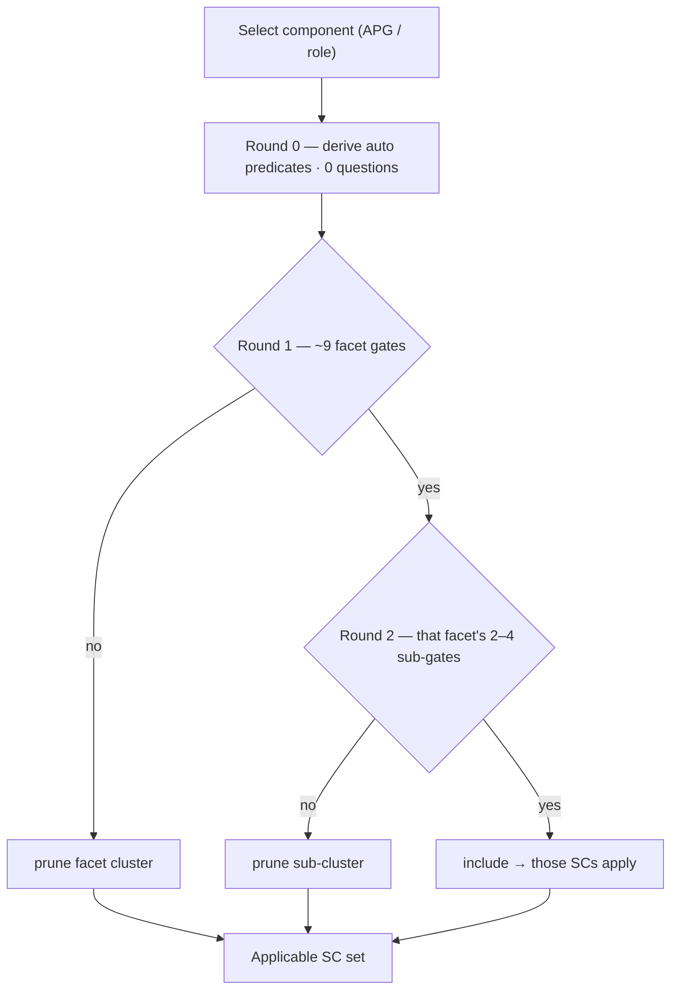

## The gate map — full tree

Nine coarse facets (level 1), each split into sub-gates (level 2), each resolving to its predicate leaves (level 3). One subtree per facet — a single combined tree would be ~175 nodes. "gates SCs" is how many criteria the facet can decide. Below each tree, the same leaves as a table.

### media

**Gate:** Any audio or video (time-based media)?  ·  gates 13 SCs (1.2.1, 1.2.2, 1.2.3, 1.2.4, 1.2.5, 1.2.6, 1.2.7, 1.2.8, 1.2.9, 1.4.2, 1.4.4, 1.4.7, 2.2.3)

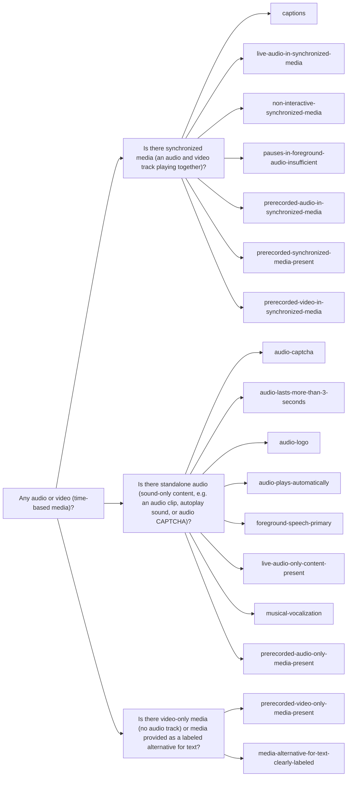
| Sub-gate | predicate leaves |
|---|---|
| Is there synchronized media (an audio and video track playing together)? | `captions` `live-audio-in-synchronized-media` `non-interactive-synchronized-media` `pauses-in-foreground-audio-insufficient` `prerecorded-audio-in-synchronized-media` `prerecorded-synchronized-media-present` `prerecorded-video-in-synchronized-media` |
| Is there standalone audio (sound-only content, e.g. an audio clip, autoplay sound, or audio CAPTCHA)? | `audio-captcha` `audio-lasts-more-than-3-seconds` `audio-logo` `audio-plays-automatically` `foreground-speech-primary` `live-audio-only-content-present` `musical-vocalization` `prerecorded-audio-only-media-present` |
| Is there video-only media (no audio track) or media provided as a labeled alternative for text? | `prerecorded-video-only-media-present` `media-alternative-for-text-clearly-labeled` |

### images

**Gate:** Any images, icons, or graphics (non-text content)?  ·  gates 6 SCs (1.1.1, 1.3.6, 1.4.4, 1.4.5, 1.4.9, 2.5.3)

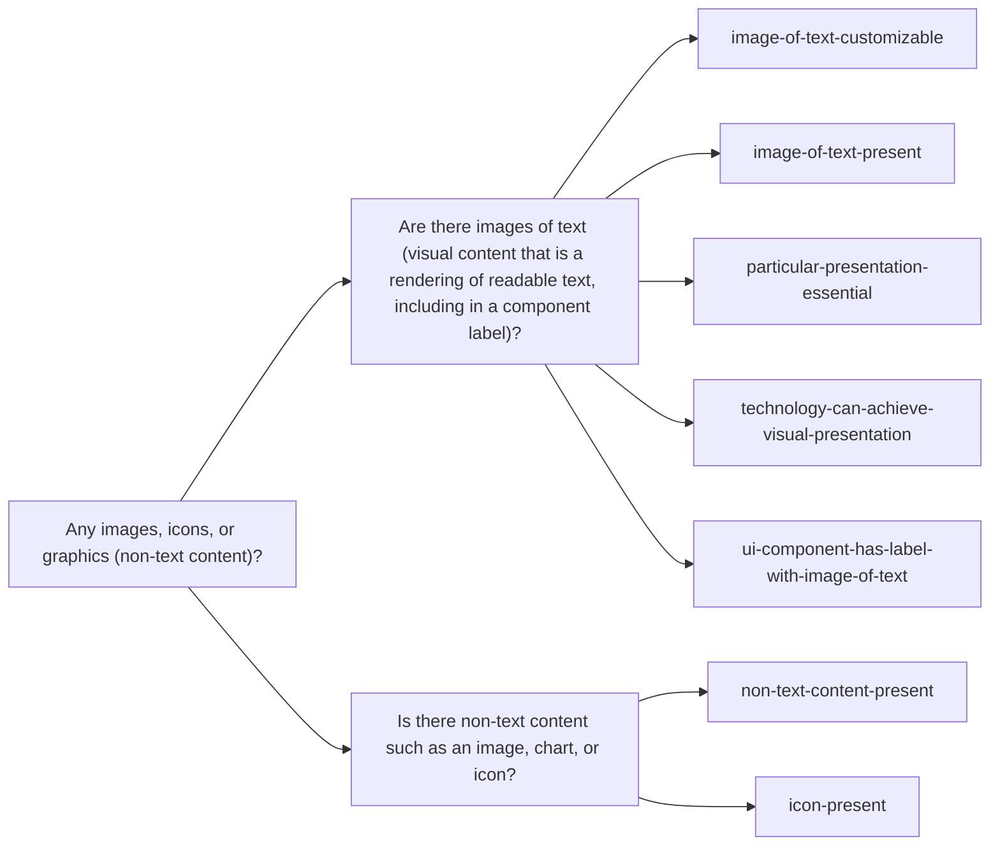
| Sub-gate | predicate leaves |
|---|---|
| Are there images of text (visual content that is a rendering of readable text, including in a component label)? | `image-of-text-customizable` `image-of-text-present` `particular-presentation-essential` `technology-can-achieve-visual-presentation` `ui-component-has-label-with-image-of-text` |
| Is there non-text content such as an image, chart, or icon? | `non-text-content-present` `icon-present` |

### color-contrast

**Gate:** Does anything rely on color, or need visual contrast?  ·  gates 4 SCs (1.4.1, 1.4.3, 1.4.6, 1.4.11)

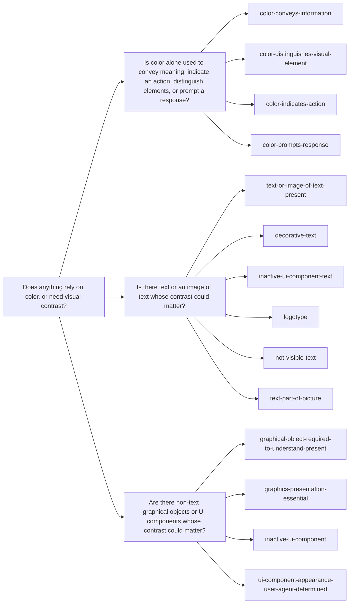
| Sub-gate | predicate leaves |
|---|---|
| Is color alone used to convey meaning, indicate an action, distinguish elements, or prompt a response? | `color-conveys-information` `color-distinguishes-visual-element` `color-indicates-action` `color-prompts-response` |
| Is there text or an image of text whose contrast could matter? | `text-or-image-of-text-present` `decorative-text` `inactive-ui-component-text` `logotype` `not-visible-text` `text-part-of-picture` |
| Are there non-text graphical objects or UI components whose contrast could matter? | `graphical-object-required-to-understand-present` `graphics-presentation-essential` `inactive-ui-component` `ui-component-appearance-user-agent-determined` |

### text-language

**Gate:** Is there reading text / language content?  ·  gates 9 SCs (1.4.4, 1.4.8, 1.4.12, 2.5.3, 3.1.2, 3.1.3, 3.1.4, 3.1.5, 3.1.6)

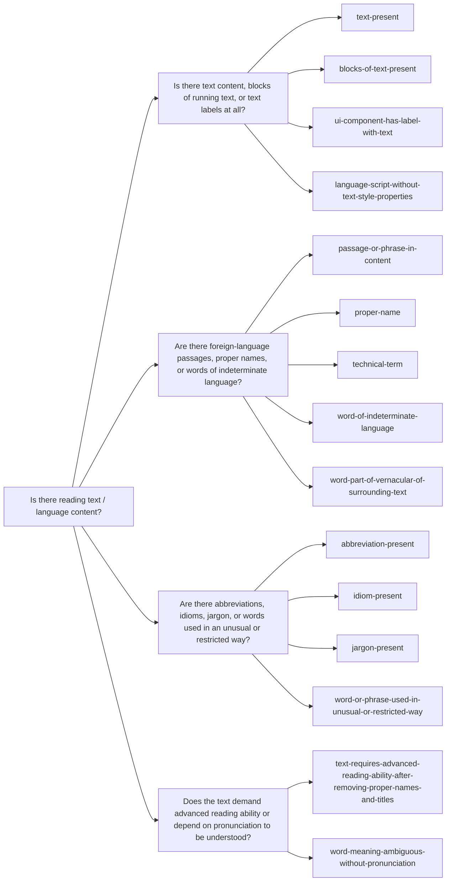
| Sub-gate | predicate leaves |
|---|---|
| Is there text content, blocks of running text, or text labels at all? | `text-present` `blocks-of-text-present` `ui-component-has-label-with-text` `language-script-without-text-style-properties` |
| Are there foreign-language passages, proper names, or words of indeterminate language? | `passage-or-phrase-in-content` `proper-name` `technical-term` `word-of-indeterminate-language` `word-part-of-vernacular-of-surrounding-text` |
| Are there abbreviations, idioms, jargon, or words used in an unusual or restricted way? | `abbreviation-present` `idiom-present` `jargon-present` `word-or-phrase-used-in-unusual-or-restricted-way` |
| Does the text demand advanced reading ability or depend on pronunciation to be understood? | `text-requires-advanced-reading-ability-after-removing-proper-names-and-titles` `word-meaning-ambiguous-without-pronunciation` |

### timing-motion

**Gate:** Any time limits, moving/auto-updating content, animation, or flashing?  ·  gates 9 SCs (2.2.1, 2.2.2, 2.2.3, 2.2.4, 2.2.5, 2.2.6, 2.3.1, 2.3.2, 2.3.3)

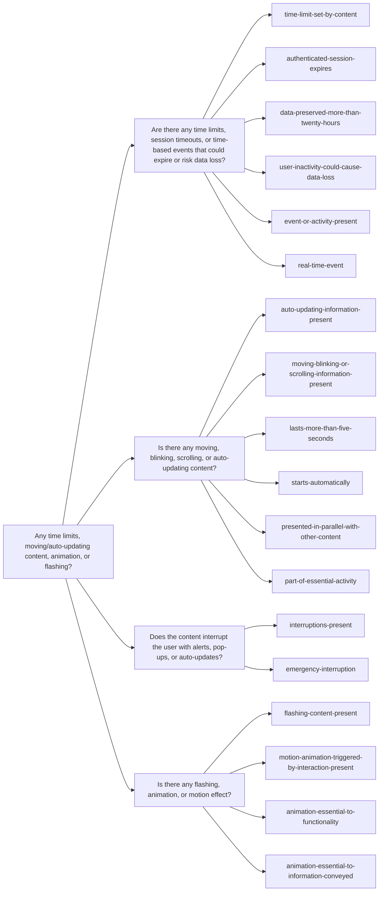
| Sub-gate | predicate leaves |
|---|---|
| Are there any time limits, session timeouts, or time-based events that could expire or risk data loss? | `time-limit-set-by-content` `authenticated-session-expires` `data-preserved-more-than-twenty-hours` `user-inactivity-could-cause-data-loss` `event-or-activity-present` `real-time-event` |
| Is there any moving, blinking, scrolling, or auto-updating content? | `auto-updating-information-present` `moving-blinking-or-scrolling-information-present` `lasts-more-than-five-seconds` `starts-automatically` `presented-in-parallel-with-other-content` `part-of-essential-activity` |
| Does the content interrupt the user with alerts, pop-ups, or auto-updates? | `interruptions-present` `emergency-interruption` |
| Is there any flashing, animation, or motion effect? | `flashing-content-present` `motion-animation-triggered-by-interaction-present` `animation-essential-to-functionality` `animation-essential-to-information-conveyed` |

### pointer-gesture

**Gate:** Any pointer gestures, dragging, motion, or touch targets?  ·  gates 7 SCs (2.1.1, 2.5.1, 2.5.2, 2.5.4, 2.5.5, 2.5.7, 2.5.8)

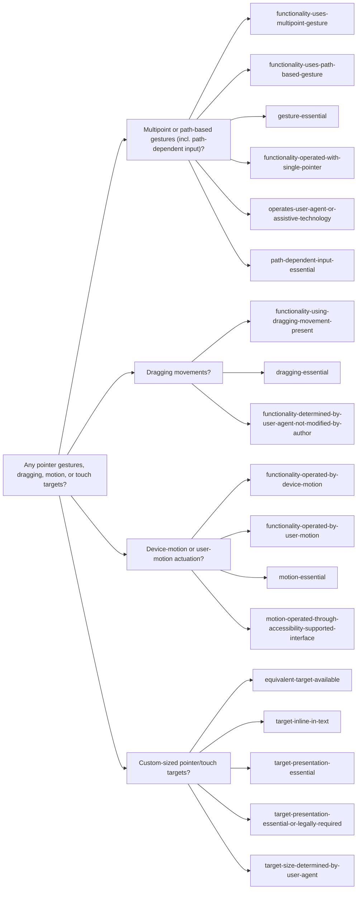
| Sub-gate | predicate leaves |
|---|---|
| Multipoint or path-based gestures (incl. path-dependent input)? | `functionality-uses-multipoint-gesture` `functionality-uses-path-based-gesture` `gesture-essential` `functionality-operated-with-single-pointer` `operates-user-agent-or-assistive-technology` `path-dependent-input-essential` |
| Dragging movements? | `functionality-using-dragging-movement-present` `dragging-essential` `functionality-determined-by-user-agent-not-modified-by-author` |
| Device-motion or user-motion actuation? | `functionality-operated-by-device-motion` `functionality-operated-by-user-motion` `motion-essential` `motion-operated-through-accessibility-supported-interface` |
| Custom-sized pointer/touch targets? | `equivalent-target-available` `target-inline-in-text` `target-presentation-essential` `target-presentation-essential-or-legally-required` `target-size-determined-by-user-agent` |

### forms-input

**Gate:** Does it collect user input (forms/fields)?  ·  gates 8 SCs (1.3.5, 3.3.1, 3.3.2, 3.3.3, 3.3.6, 3.3.7, 3.3.8, 3.3.9)

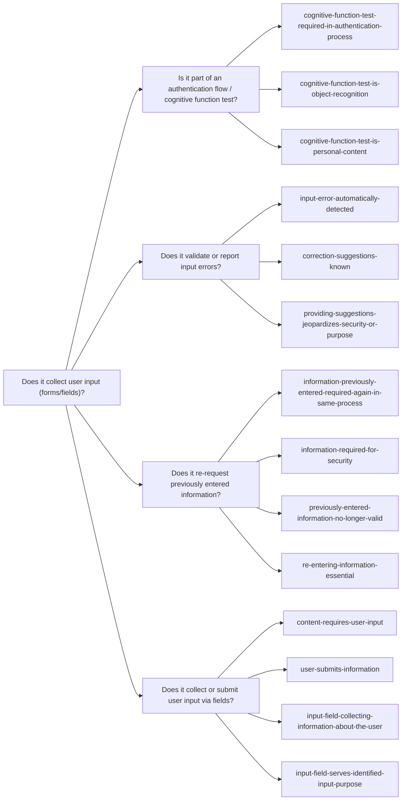
| Sub-gate | predicate leaves |
|---|---|
| Is it part of an authentication flow / cognitive function test? | `cognitive-function-test-required-in-authentication-process` `cognitive-function-test-is-object-recognition` `cognitive-function-test-is-personal-content` |
| Does it validate or report input errors? | `input-error-automatically-detected` `correction-suggestions-known` `providing-suggestions-jeopardizes-security-or-purpose` |
| Does it re-request previously entered information? | `information-previously-entered-required-again-in-same-process` `information-required-for-security` `previously-entered-information-no-longer-valid` `re-entering-information-essential` |
| Does it collect or submit user input via fields? | `content-requires-user-input` `user-submits-information` `input-field-collecting-information-about-the-user` `input-field-serves-identified-input-purpose` |

### navigation-context

**Gate:** Is it navigation, part of a page set, or a multi-step/transactional process?  ·  gates 10 SCs (2.4.1, 2.4.4, 2.4.5, 2.4.8, 2.4.9, 3.2.3, 3.2.4, 3.2.5, 3.2.6, 3.3.4)

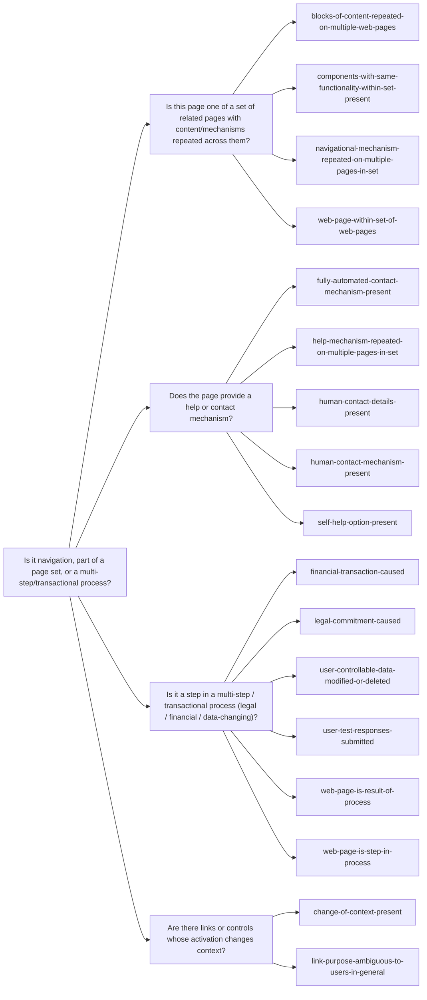
| Sub-gate | predicate leaves |
|---|---|
| Is this page one of a set of related pages with content/mechanisms repeated across them? | `blocks-of-content-repeated-on-multiple-web-pages` `components-with-same-functionality-within-set-present` `navigational-mechanism-repeated-on-multiple-pages-in-set` `web-page-within-set-of-web-pages` |
| Does the page provide a help or contact mechanism? | `fully-automated-contact-mechanism-present` `help-mechanism-repeated-on-multiple-pages-in-set` `human-contact-details-present` `human-contact-mechanism-present` `self-help-option-present` |
| Is it a step in a multi-step / transactional process (legal / financial / data-changing)? | `financial-transaction-caused` `legal-commitment-caused` `user-controllable-data-modified-or-deleted` `user-test-responses-submitted` `web-page-is-result-of-process` `web-page-is-step-in-process` |
| Are there links or controls whose activation changes context? | `change-of-context-present` `link-purpose-ambiguous-to-users-in-general` |

### structure-focus

**Gate:** Does it convey structure, or manage focus/keyboard interaction?  ·  gates 11 SCs (1.3.1, 1.3.2, 1.3.3, 1.3.4, 1.4.10, 1.4.13, 2.1.4, 2.4.3, 2.4.11, 2.4.12, 2.4.13)

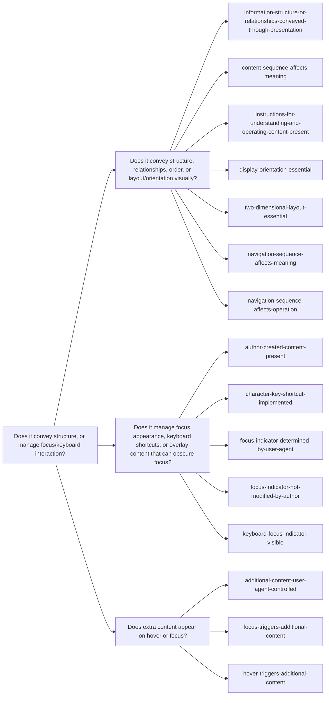
| Sub-gate | predicate leaves |
|---|---|
| Does it convey structure, relationships, order, or layout/orientation visually? | `information-structure-or-relationships-conveyed-through-presentation` `content-sequence-affects-meaning` `instructions-for-understanding-and-operating-content-present` `display-orientation-essential` `two-dimensional-layout-essential` `navigation-sequence-affects-meaning` `navigation-sequence-affects-operation` |
| Does it manage focus appearance, keyboard shortcuts, or overlay content that can obscure focus? | `author-created-content-present` `character-key-shortcut-implemented` `focus-indicator-determined-by-user-agent` `focus-indicator-not-modified-by-author` `keyboard-focus-indicator-visible` |
| Does extra content appear on hover or focus? | `additional-content-user-agent-controlled` `focus-triggers-additional-content` `hover-triggers-additional-content` |

## Measured cost

Running the rounds engine over a spread of components (with representative answer sets). Every one resolves **fully** — zero `depends` — in two question-rounds.

| Component | widget | yes-facets | questions (9 + sub) | applies | n/a | depends |
|---|---|---|---|---|---|---|
| alert | no | 2 | **16** | 12 | 74 | 0 |
| disclosure | yes | 3 | **19** | 22 | 64 | 0 |
| table | yes | 3 | **19** | 21 | 65 | 0 |
| tabs | yes | 3 | **19** | 24 | 62 | 0 |
| breadcrumb | no | 4 | **23** | 12 | 74 | 0 |
| checkbox | yes | 4 | **23** | 26 | 60 | 0 |
| combobox | yes | 4 | **23** | 29 | 57 | 0 |
| dialog | yes | 4 | **23** | 28 | 58 | 0 |

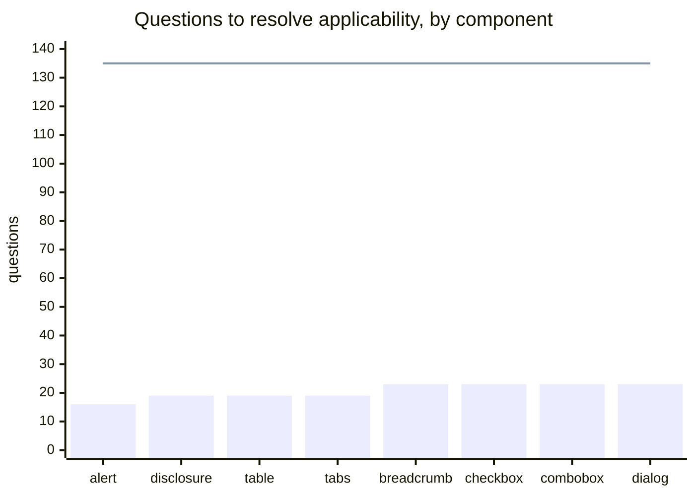
The bars are the rounds engine; the flat line at 135 is the naive "ask every non-auto predicate." The count scales with component richness (2 active facets → ~16, 4 → ~23) and stays bounded well under the naive baseline.

## Why it converges

- **70 of 86 SCs are gated by a single facet** (see [reducibility]({{ '/classifier/predicates/#reducibility' | relative_url }})), so one gate cleanly decides each.
- **Within a facet the prior is skewed too** — "there is text? yes" but "abbreviations / idioms / foreign-language? no, no, no" — so sub-gates prune most of a yes-facet's contents.
- The tree is therefore **shallow (2 levels)** and the answers are **mostly "no"**, which is what collapses 135 → ~20.

## Caveats

- The per-component figures use **representative hardcoded answer sets** — what is validated is the mechanism and the bounded question count, not the exact `applies` for each component.
- "yes → include the cluster" is **conservative**: it can slightly over-apply. That is the safe direction for applicability (over-include for review, never silently miss); exceptions are refined at verification.
- The count can drop further: several facet gates are themselves **derivable** (`forms-input` ⇐ an input role, `navigation-context` ⇐ a link role), so a real agent would not ask them.
- Prototype only — `eval-rounds.mjs` / `rounds-lib.mjs` in `classify/`, not wired into the build.
