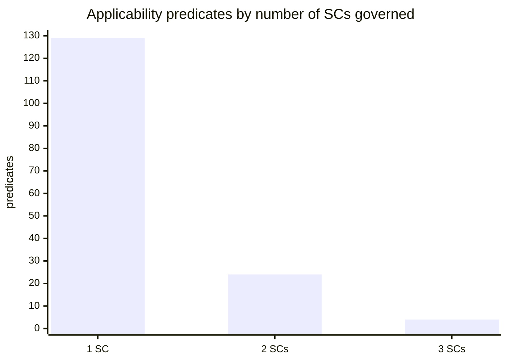
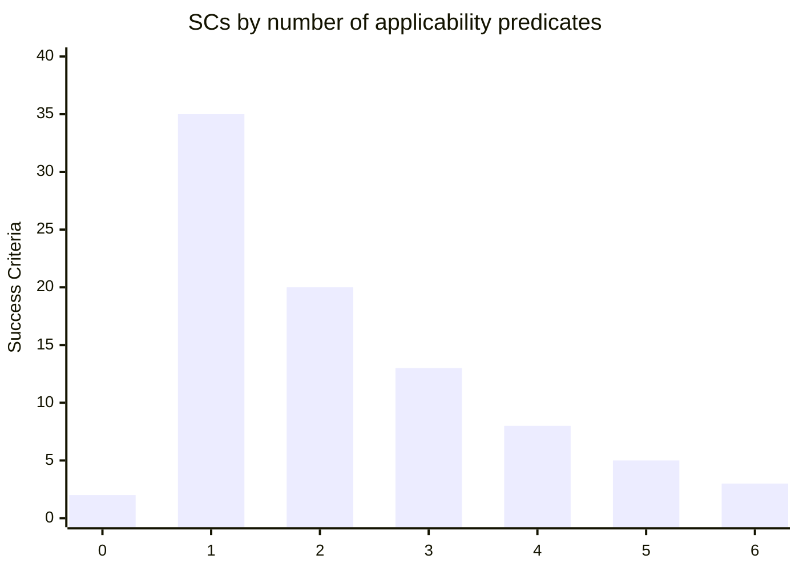
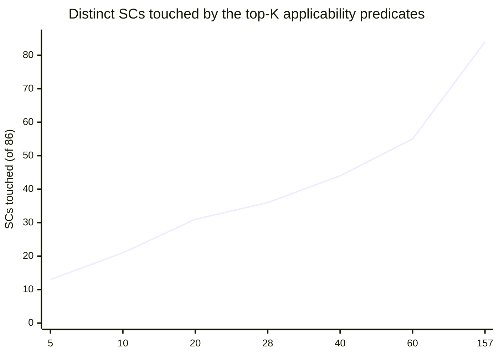
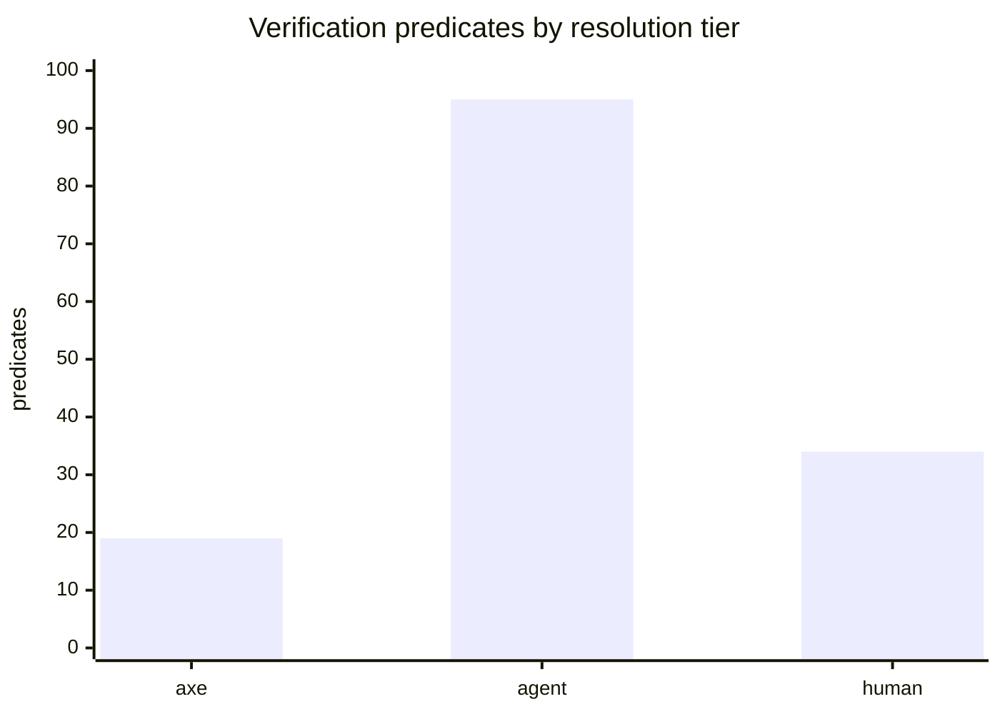

# Predicates

The data behind the [classifier]({{ '/classifier/' | relative_url }}): the applicability and verification predicate registries, the per-criterion expressions, and the reducibility analysis. For what it implies about automated accessibility verification, see [Automation assessment]({{ '/classifier/assessment/' | relative_url }}).

## Motivation

a11y-assist reaches WCAG and ACT from a component by *search* (`search_act` / `search_wcag`). Search is a heuristic over prose, and it dead-ends: some components (e.g. `alert`, `breadcrumb`) return no link at all, because W3C never published a clean component-to-criterion crosswalk — the bridge lives only in prose.

The classifier explores a deterministic alternative. Instead of asking "what text matches this component?", it asks **"under what conditions does each WCAG criterion apply, and what must then be true to conform?"** — and encodes both as data we can evaluate. Given the conditions that hold for a component we compute, mechanically, which criteria apply and which checks they impose — with no search and no dead-ends.

## The model

Two parallel predicate layers, same shape:

- **Applicability** — each SC gets an expression over atomic *trigger* predicates (`non-text-content-present`): *when* the criterion applies. Each predicate has a **class**: `auto` (decided from the component's structure), `instance` (needs the authored markup), `human` (needs judgment).
- **Verification** — each SC gets an expression over atomic *postcondition* predicates (`text-alternative-serves-equivalent-purpose`): *what must hold* to conform. Each predicate has a **resolution tier** — how it is settled *after the component is built*: `axe` (an axe-core rule verifies it), `agent` (no axe rule, but an AI agent can confirm it by inspecting the built code), `human` (needs judgment even with the finished artifact).
Evaluation (planned) is **three-valued** (true / false / *unknown*): an unresolved predicate yields a `depends` result rather than a silent false — and that `depends` set *is* the checklist. The evaluator is the next step and is not yet built; this page exists to review the data it will run on.

## The flow this maps to

The two layers resolve at two different phases of building a component:

```
PHASE 1 — PLANNING (before code exists)
  BUILD → component → choose APG pattern OR HTML element
    ⇒ AUTO applicability predicates resolved by the choice itself
    → agent evaluates INSTANCE applicability (intent: "will it contain images / a timer / media?")
    → questionnaire for HUMAN applicability
    ⇒ the APPLICABLE SCs  +  the verification predicates to check later

PHASE 2 — VERIFICATION (after the component is built)
    → axe runs on the built HTML        ⇒ resolves the `axe`-tier predicates
    → agent inspects the built code     ⇒ resolves the `agent`-tier predicates
    → remaining `human`-tier predicates ⇒ user questionnaire
```

## Pipeline

| Step | What | Output |
|---|---|---|
| 1. Extract | Blind, per-SC: each SC's normative text → an applicability expression *and* a verification (obligation) expression, both over granular predicates with evidence quotes. | `*.raw.json` |
| 2. Canonicalize | Merge true synonyms into a controlled vocabulary; rewrite expressions against it. | `*.canon.json` |
| 3. Classify | Applicability predicates → `class`; verification predicates → resolution `tier` (matched against axe-core's real rule set). | `*.classified.json` |
| 4. Evaluate | *(planned)* Three-valued engine: applicability → applicable SCs → their obligations → the tiered checklist. | — |

Headline numbers:

- **86** Success Criteria, all expressed on both layers.
- **Applicability:** 162 → 157 canonical predicates; class **22 auto / 72 instance / 63 human**; **13** SCs decided from structure alone.
- **Verification:** 159 → 148 canonical postconditions; tier **19 axe / 95 agent / 34 human**.
- After build, per-SC obligation: **10** closed by axe alone, **45** closable by axe + agent (no user), **31** require the user.

## Reducibility

How much structure do the predicates impose on the 86 criteria? For **applicability**, two opposite readings hold: reducible at the criterion level (most SCs hinge on one condition) but not at the vocabulary level (the predicate set barely compresses).

### Predicate reuse (applicability)


28 predicates recur across more than one SC; **129** are one-offs.

### Criterion complexity (applicability)


**37** of 86 criteria are decided by zero or one applicability predicate.

### Coverage (applicability)

Top-K predicates by reuse vs distinct criteria touched — near-linear, so there is no small "core set."



### Criterion clusters (applicability)

Linking criteria that share a predicate decomposes the corpus into **63** near-independent units: **50** isolated criteria and **13** small families.

| Size | Criteria in the family |
|---|---|
| 8 | 1.2.1, 1.2.2, 1.2.3, 1.2.5, 1.2.6, 1.2.7, 1.2.8, 1.4.7 |
| 5 | 1.3.6, 1.4.10, 2.4.10, 4.1.2, 4.1.3 |
| 3 | 1.4.4, 1.4.5, 1.4.9 |
| 2 | 1.4.3, 1.4.6 |
| 2 | 2.1.1, 2.1.3 |
| 2 | 2.3.1, 2.3.2 |
| 2 | 2.4.4, 2.4.9 |
| 2 | 2.4.5, 2.4.8 |
| 2 | 2.4.11, 2.4.12 |
| 2 | 2.5.1, 2.5.2 |
| 2 | 2.5.5, 2.5.8 |
| 2 | 3.3.1, 3.3.3 |
| 2 | 3.3.8, 3.3.9 |

### Applicability vs verification

Does the verification layer compress more than applicability? We extracted obligations the same way and compared. It does **not** — verification is, if anything, the *most* bespoke layer. WCAG obligations are individuated by criterion almost by definition. (Real reuse only appears when ACT *operationalizes* several criteria with one shared mechanical check, and even that is small.)

| layer | distinct predicates | singletons | max reuse |
|---|---|---|---|
| Applicability | 157 | 82% | 3 |
| Verification (SC obligations) | 148 | 89% | 4 |

The takeaway reframes the effort: the payoff is **routing, not compression**. Reducibility is *per-component* (a button triggers a handful of predicates, not 157), not global.

## Verification coverage after axe

Each verification predicate tagged by how it is resolved once the component is built, matched against axe-core's actual 104-rule set. This is the concrete answer to "what does the automated audit leave behind."


Rolled up per criterion — what is needed to fully verify each SC's obligation:

| After the build… | SCs |
|---|---|
| **axe alone** closes the obligation | 10 |
| **axe + agent** close it (no user needed) | 45 |
| **user input** required | 31 |

So automated tooling fully closes **10** of 86 criteria; the agent can finish another **45** by inspecting the built code; and **31** genuinely need a person. Per *predicate*, axe touches only **19** of 148 — a sharper figure than the usual "axe covers ~50%," because most obligations decompose into one axe-checkable property plus several that are not.

## Applicability — predicate registry

The 157 canonical applicability conditions, grouped by detectability class. "SCs" lists the criteria whose applicability references the predicate.

### auto (22)

| Predicate | Scope | SCs | Definition |
|---|---|---|---|
| `ui-component-present` | component | 1.3.6, 2.4.10, 4.1.2 | TRUE when the component exposes a user interface component role (a perceivable/operable UI element). |
| `content-implemented-using-markup-languages` | component | 1.3.6, 4.1.3 | TRUE when the content is implemented using a markup language (e.g., HTML). |
| `content-present` | page | 1.4.10, 2.4.10 | TRUE when there is content present to be presented to the user. |
| `functionality-present` | component | 2.1.1, 2.1.3 | TRUE when the component provides operable functionality (its role is operable). |
| `link-present` | component | 2.4.4, 2.4.9 | TRUE when the component has a link role (or is a native anchor with href). |
| `target-for-pointer-input-present` | component | 2.5.5, 2.5.8 | TRUE when the component is a target that can be operated by pointer input (operable role). |
| `ui-component-receives-keyboard-focus` | component | 2.4.11, 2.4.12 | TRUE when the component can receive keyboard focus (focusable per its role). |
| `content-using-markup-supporting-text-style-properties` | component | 1.4.12 | TRUE when the content is implemented in a markup language (e.g. HTML/CSS) that supports the listed text style properties. |
| `content-with-view-and-operation-present` | component | 1.3.4 | TRUE when there is content that has a visual presentation and can be operated by the user. |
| `heading-present` | component | 2.4.6 | True if the component carries a heading role (native heading element or role=heading). |
| `implemented-with-technology-supporting-input-purpose-identification` | component | 1.3.5 | True if the technology used supports programmatically identifying the expected meaning of form input (e.g. HTML's autocomplete attribute). |
| `input-modality-available-on-platform` | page | 2.5.6 | True if input modalities exist on the platform (keyboard, pointer, touch), which is effectively always the case for web content. |
| `keyboard-focus-can-be-moved-to-component` | component | 2.1.2 | True when the component's role/contract makes it focusable via a keyboard interface. |
| `keyboard-operable-user-interface-present` | component | 2.4.7 | True when the component's role/contract defines a keyboard-operable user interface. |
| `label-present` | component | 2.4.6 | True when the component is one whose contract requires or supports an author-provided label/accessible name. |
| `region-present` | component | 1.3.6 | True when the component is a landmark/region whose purpose can be programmatically determined. |
| `status-message-present` | component | 4.1.3 | True when the component's role exposes a live region (e.g., role=status or role=alert) that conveys status messages programmatically. |
| `ui-component-receives-focus` | component | 3.2.1 | True when the component's role makes it focusable so it can receive focus. |
| `ui-component-setting-can-be-changed` | component | 3.2.2 | True when the component's role provides a changeable setting/state (e.g., a form control or selectable widget). |
| `ui-component-visual-information-present` | component | 1.4.11 | True when the component has an operable role with visual information needed to identify the component and its states. |
| `web-page-navigable-sequentially` | page | 2.4.3 | True when the page can be navigated sequentially via the keyboard (has focusable content in a focus order). |
| `web-page-present` | page | 3.1.1 | True when the content is delivered as a web page. |

### instance (72)

| Predicate | Scope | SCs | Definition |
|---|---|---|---|
| `image-of-text-present` | component | 1.4.4, 1.4.5, 1.4.9 | TRUE when the authored content contains an image whose visual content is a rendering of readable text. |
| `prerecorded-video-in-synchronized-media` | component | 1.2.3, 1.2.5, 1.2.7 | TRUE when the authored content includes prerecorded synchronized media that contains a video track. |
| `author-created-content-present` | component | 2.4.11, 2.4.12 | TRUE when the page contains author-created content (e.g., sticky or overlay elements) that can obscure a focused component. |
| `flashing-content-present` | component | 2.3.1, 2.3.2 | TRUE when the authored content contains something that flashes. |
| `inactive-ui-component-text` | component | 1.4.3, 1.4.6 | TRUE when the text is part of a disabled/inactive user interface component. |
| `input-error-automatically-detected` | component | 3.3.1, 3.3.3 | TRUE when the content automatically detects an input error made by the user. |
| `not-visible-text` | component | 1.4.3, 1.4.6 | TRUE when the text is not visible to any user (e.g., visually hidden via markup or CSS). |
| `prerecorded-audio-in-synchronized-media` | component | 1.2.2, 1.2.6 | TRUE when the authored content includes prerecorded synchronized media that contains audio. |
| `prerecorded-audio-only-media-present` | component | 1.2.1, 1.4.7 | TRUE when the authored content includes prerecorded audio-only media. |
| `prerecorded-video-only-media-present` | component | 1.2.1, 1.2.8 | TRUE when the authored content includes prerecorded video-only media (no audio track). |
| `target-inline-in-text` | component | 2.5.5, 2.5.8 | TRUE when the target is positioned inline within a sentence or block of text. |
| `target-size-determined-by-user-agent` | component | 2.5.5, 2.5.8 | TRUE when the target's size is left to the user-agent default and not modified by the author. |
| `text-or-image-of-text-present` | component | 1.4.3, 1.4.6 | TRUE when the authored content contains text or an image of text. |
| `abbreviation-present` | component | 3.1.4 | TRUE when the authored content contains an abbreviation or acronym. |
| `additional-content-user-agent-controlled` | component | 1.4.13 | TRUE when the additional content's visual presentation is controlled by the user agent and not modified by the author. |
| `audio-captcha` | component | 1.4.7 | TRUE when the audio content functions as a CAPTCHA, i.e. an audio challenge used to distinguish humans from machines. |
| `audio-lasts-more-than-3-seconds` | component | 1.4.2 | TRUE when the duration of the audio content exceeds 3 seconds. |
| `audio-plays-automatically` | component | 1.4.2 | TRUE when audio begins playing automatically without the user initiating it. |
| `authenticated-session-expires` | process | 2.2.5 | TRUE when an authenticated user session can time out or expire during use. |
| `auto-updating-information-present` | component | 2.2.2 | TRUE when the content includes information that updates automatically without user action. |
| `blocks-of-content-repeated-on-multiple-web-pages` | site | 2.4.1 | TRUE when one or more blocks of content (e.g. navigation, banners) are repeated across multiple pages in the set. |
| `blocks-of-text-present` | component | 1.4.8 | TRUE when the content contains blocks of running text (multi-sentence prose). |
| `captions` | component | 1.4.4 | TRUE when the content in question is captions for synchronized media. |
| `change-of-context-present` | component | 3.2.5 | TRUE when an interaction triggers a change of context (e.g. new window, focus move, major content change). |
| `character-key-shortcut-implemented` | component | 2.1.4 | TRUE when a keyboard shortcut using only letter, punctuation, number, or symbol characters is implemented in the content. |
| `content-requires-user-input` | component | 3.3.2 | TRUE when the content includes fields or controls that require the user to enter data. |
| `data-preserved-more-than-twenty-hours` | component | 2.2.6 | TRUE when user-entered data is preserved for more than 20 hours of inactivity. |
| `event-or-activity-present` | component | 2.2.3 | TRUE when the content presents a time-based event or activity to the user. |
| `focus-indicator-determined-by-user-agent` | component | 2.4.13 | TRUE when the focus indicator is left to the user agent and cannot be adjusted by the author. |
| `focus-indicator-not-modified-by-author` | component | 2.4.13 | TRUE when the focus indicator and its background color are not modified by the author. |
| `focus-triggers-additional-content` | component | 1.4.13 | True if moving keyboard focus onto the component makes extra content (e.g. a tooltip or popup) appear that hides again when focus leaves. |
| `fully-automated-contact-mechanism-present` | component | 3.2.6 | True if the content provides a fully automated way to get help, such as a chatbot or automated self-service contact form. |
| `functionality-determined-by-user-agent-not-modified-by-author` | component | 2.5.7 | True if the dragging/operation behavior is the user agent's native default and is not customized or overridden by the author. |
| `functionality-operated-by-device-motion` | component | 2.5.4 | True if some functionality can be triggered by moving the device itself, such as shaking or tilting. |
| `functionality-operated-by-user-motion` | component | 2.5.4 | True if some functionality can be triggered by the user's own body motion sensed by the device, such as a gesture in front of a camera. |
| `functionality-operated-with-single-pointer` | component | 2.5.2 | True if the component can be operated using a single pointer (e.g. one finger tap, click, or single-finger drag). |
| `functionality-uses-multipoint-gesture` | component | 2.5.1 | True if operating the functionality requires a multipoint gesture such as a two-finger pinch or two-finger tap. |
| `functionality-uses-path-based-gesture` | component | 2.5.1 | True if operating the functionality requires a path-based gesture such as a swipe or a drag along a specific path. |
| `functionality-using-dragging-movement-present` | component | 2.5.7 | True if some functionality is operated by a dragging movement (pressing, moving, and releasing a pointer). |
| `help-mechanism-repeated-on-multiple-pages-in-set` | site | 3.2.6 | True if the same help mechanism appears in the same relative order on multiple pages within a set of web pages. |
| `hover-triggers-additional-content` | component | 1.4.13 | True if hovering a pointer over the component makes extra content (e.g. a tooltip or popup) appear that hides again when the pointer leaves. |
| `human-contact-details-present` | component | 3.2.6 | True if the content provides human contact details such as a phone number, email address, or physical address. |
| `human-contact-mechanism-present` | component | 3.2.6 | True if the content provides a mechanism to reach a human, such as a contact form, messaging app, or social media channel. |
| `icon-present` | component | 1.3.6 | True if the authored content includes an icon (icon font, SVG, or image acting as an icon). |
| `image-of-text-customizable` | component | 1.4.5 | True if the image of text can be visually customized by the user (font, size, color, spacing) to their requirements. |
| `inactive-ui-component` | component | 1.4.11 | True if the user interface component is in an inactive/disabled state in the authored instance. |
| `information-previously-entered-required-again-in-same-process` | process | 3.3.7 | True if information already entered by or provided to the user must be entered again at a later step of the same process. |
| `input-field-collecting-information-about-the-user` | component | 1.3.5 | True if the field is an input that collects information about the user (e.g. name, email, address) rather than general/search input. |
| `interruptions-present` | component | 2.2.4 | True if the content presents interruptions such as alerts, auto-updates, or popups that interrupt the user. |
| `keyboard-focus-indicator-visible` | component | 2.4.13 | True when the authored markup/styles render a visible keyboard focus indicator on the focused component. |
| `lasts-more-than-five-seconds` | component | 2.2.2 | True when the moving/blinking/scrolling or auto-updating content runs for more than five seconds. |
| `live-audio-in-synchronized-media` | component | 1.2.4 | True when the content contains live audio that is part of synchronized media. |
| `live-audio-only-content-present` | component | 1.2.9 | True when the content contains live audio-only media. |
| `motion-animation-triggered-by-interaction-present` | component | 2.3.3 | True when the authored content includes motion animation triggered by a user interaction. |
| `motion-operated-through-accessibility-supported-interface` | component | 2.5.4 | True when the motion-operated functionality is also operable through an accessibility-supported interface. |
| `moving-blinking-or-scrolling-information-present` | component | 2.2.2 | True when the content includes moving, blinking, or scrolling information. |
| `navigational-mechanism-repeated-on-multiple-pages-in-set` | site | 3.2.3 | True when the same navigational mechanism appears on multiple pages within a set of web pages. |
| `non-interactive-synchronized-media` | component | 2.2.3 | True when the content is non-interactive synchronized media. |
| `non-text-content-present` | component | 1.1.1 | True when the authored content includes non-text content such as an image, icon, or chart. |
| `passage-or-phrase-in-content` | component | 3.1.2 | True when the content contains a distinct passage or phrase (e.g., in a different human language) within surrounding text. |
| `prerecorded-synchronized-media-present` | component | 1.2.8 | True when the content includes prerecorded synchronized media. |
| `presented-in-parallel-with-other-content` | component | 2.2.2 | True when the moving or auto-updating content is displayed alongside other content. |
| `real-time-event` | component | 2.2.3 | True when the content presents a real-time (live) event. |
| `self-help-option-present` | page | 3.2.6 | True when the page provides a self-help option (e.g., FAQ, help page, or search) as a help mechanism for users. |
| `starts-automatically` | component | 2.2.2 | True when moving, blinking, scrolling, or auto-updating content begins on its own without the user initiating it. |
| `technology-can-achieve-visual-presentation` | component | 1.4.5 | True when the technologies actually used by the content are capable of rendering the desired visual presentation as real text rather than an image of text. |
| `text-present` | component | 1.4.4 | True when the authored content contains textual content (not an image of text). |
| `time-limit-set-by-content` | page | 2.2.1 | True when the content imposes a time limit on a user interaction or session. |
| `ui-component-appearance-user-agent-determined` | component | 1.4.11 | True when the component's visual appearance is determined by the user agent default and is not modified by the author. |
| `ui-component-has-label-with-image-of-text` | component | 2.5.3 | True when the component's visible label includes an image of text. |
| `ui-component-has-label-with-text` | component | 2.5.3 | True when the component has a visible label that includes text. |
| `user-submits-information` | page | 3.3.6 | True when the page requires the user to submit information (e.g., contains a submittable form). |

### human (63)

| Predicate | Scope | SCs | Definition |
|---|---|---|---|
| `media-alternative-for-text-clearly-labeled` | component | 1.2.1, 1.2.2, 1.2.3 | TRUE when the audio or video serves as an alternative presenting information already available in text and is explicitly labeled as such. |
| `cognitive-function-test-required-in-authentication-process` | process | 3.3.8, 3.3.9 | TRUE when any step of an authentication process requires the user to perform a cognitive function test such as recalling a password or solving a puzzle. |
| `decorative-text` | component | 1.4.3, 1.4.6 | TRUE when the text serves no informational purpose and is purely decorative. |
| `link-purpose-ambiguous-to-users-in-general` | component | 2.4.4, 2.4.9 | TRUE when the link's purpose would be ambiguous to users in general even given its programmatic context. |
| `logotype` | component | 1.4.3, 1.4.6 | TRUE when the text is part of a logo or brand name. |
| `operates-user-agent-or-assistive-technology` | component | 2.5.1, 2.5.2 | TRUE when the action or gesture is required to operate the user agent or assistive technology rather than the content. |
| `text-part-of-picture` | component | 1.4.3, 1.4.6 | TRUE when the text is part of a picture that contains significant other visual content. |
| `web-page-within-set-of-web-pages` | site | 2.4.5, 2.4.8 | TRUE when the web page is one of a set of related web pages within the site. |
| `animation-essential-to-functionality` | component | 2.3.3 | TRUE when the animation is essential to the functionality being provided. |
| `animation-essential-to-information-conveyed` | component | 2.3.3 | TRUE when the animation is essential to the information being conveyed. |
| `audio-logo` | component | 1.4.7 | TRUE when the audio serves as a brand identifier (audio logo/sonic branding) rather than conveying primary content. |
| `cognitive-function-test-is-object-recognition` | component | 3.3.8 | TRUE when the cognitive function test asks the user to recognize objects. |
| `cognitive-function-test-is-personal-content` | component | 3.3.8 | TRUE when the cognitive function test asks the user to identify non-text content they previously provided to the site. |
| `color-conveys-information` | component | 1.4.1 | TRUE when color is used as a means of conveying information. |
| `color-distinguishes-visual-element` | component | 1.4.1 | TRUE when color is used to distinguish one visual element from another in a way that carries meaning. |
| `color-indicates-action` | component | 1.4.1 | TRUE when color is used to indicate that an action is available or required. |
| `color-prompts-response` | component | 1.4.1 | TRUE when color is used to prompt the user for a response. |
| `components-with-same-functionality-within-set-present` | site | 3.2.4 | TRUE when components sharing the same functionality appear on multiple pages within the set of web pages. |
| `content-sequence-affects-meaning` | page | 1.3.2 | TRUE when the order in which content is presented affects its meaning. |
| `correction-suggestions-known` | component | 3.3.3 | TRUE when a correct suggestion for fixing the detected input error is known to the author. |
| `display-orientation-essential` | component | 1.3.4 | TRUE when a specific display orientation is essential to the content's function or meaning. |
| `dragging-essential` | component | 2.5.7 | TRUE when a dragging movement is essential to the functionality and cannot be replaced by a single pointer action. |
| `emergency-interruption` | component | 2.2.4 | TRUE when the interruption involves a health, safety, or property emergency. |
| `equivalent-target-available` | component | 2.5.5 | TRUE when an equivalent link or control of at least 44 by 44 CSS pixels exists on the same page for the same function. |
| `financial-transaction-caused` | process | 3.3.4 | TRUE when submitting causes a financial transaction for the user to occur. |
| `foreground-speech-primary` | component | 1.4.7 | True if the audio consists primarily of intelligible speech in the foreground rather than music or background sound. |
| `gesture-essential` | component | 2.5.1 | True if the multipoint or path-based gesture is essential and cannot be replaced by a simpler single-pointer alternative without invalidating the activity. |
| `graphical-object-required-to-understand-present` | component | 1.4.11 | True if the content includes a graphical object (or part of one) that a user must perceive to understand the content. |
| `graphics-presentation-essential` | component | 1.4.11 | True if a particular visual presentation of the graphics is essential to the information being conveyed. |
| `idiom-present` | component | 3.1.3 | True if the text contains an idiom whose meaning is figurative and not derivable from the literal words. |
| `information-required-for-security` | component | 3.3.7 | True if re-supplying the information is required to ensure the security of the content. |
| `information-structure-or-relationships-conveyed-through-presentation` | component | 1.3.1 | True if information, structure, or relationships are conveyed visually through presentation in a way that must be made programmatically determinable or available in text. |
| `input-field-serves-identified-input-purpose` | component | 1.3.5 | True if the field's purpose maps to one of the WCAG-defined Input Purposes for user interface components. |
| `instructions-for-understanding-and-operating-content-present` | component | 1.3.3 | True if the content provides instructions for understanding or operating it. |
| `jargon-present` | component | 3.1.3 | True if the text contains jargon: specialized terms used in a particular way by a specific group. |
| `language-script-without-text-style-properties` | component | 1.4.12 | True when the content's human language or script does not make use of one or more of the targeted text-style properties (line height, letter/word/paragraph spacing). |
| `legal-commitment-caused` | process | 3.3.4 | True when completing the page or process creates a legal commitment for the user. |
| `motion-essential` | component | 2.5.4 | True when device or user motion is essential to the function such that disabling it would invalidate the activity. |
| `musical-vocalization` | component | 1.4.7 | True when the audio's vocalization is intended primarily as musical expression such as singing or rapping. |
| `navigation-sequence-affects-meaning` | page | 2.4.3 | True when the order in which the page's content is navigated changes its meaning. |
| `navigation-sequence-affects-operation` | page | 2.4.3 | True when the order in which the page's content is navigated affects its operation. |
| `part-of-essential-activity` | component | 2.2.2 | True when the movement, blinking, or scrolling is part of an activity where it is essential. |
| `particular-presentation-essential` | component | 1.4.5 | True when a specific visual presentation of the text is essential to the information being conveyed. |
| `path-dependent-input-essential` | component | 2.1.1 | True when the underlying function essentially requires input depending on the path of the user's movement and not just the endpoints. |
| `pauses-in-foreground-audio-insufficient` | component | 1.2.7 | True when natural pauses in the foreground audio are insufficient for audio descriptions to convey the sense of the video. |
| `previously-entered-information-no-longer-valid` | process | 3.3.7 | True when information previously entered in the same process is no longer valid. |
| `proper-name` | component | 3.1.2 | True when the word or phrase is a proper name. |
| `providing-suggestions-jeopardizes-security-or-purpose` | component | 3.3.3 | True when providing correction suggestions would jeopardize the security or purpose of the content. |
| `re-entering-information-essential` | process | 3.3.7 | True when re-entering the previously provided information is essential to the process. |
| `target-presentation-essential` | component | 2.5.5 | True when a particular visual presentation/size of the pointer target is essential to the information being conveyed. |
| `target-presentation-essential-or-legally-required` | component | 2.5.8 | True when a particular presentation/size of the pointer target is essential or legally required for the information being conveyed. |
| `technical-term` | component | 3.1.2 | True when a word or phrase is a technical term within its subject domain as used in context. |
| `text-requires-advanced-reading-ability-after-removing-proper-names-and-titles` | page | 3.1.5 | True when, after removing proper names and titles, the text demands reading ability beyond the lower secondary education level. |
| `two-dimensional-layout-essential` | component | 1.4.10 | True when a part of the content requires a two-dimensional layout for its usage or meaning. |
| `user-controllable-data-modified-or-deleted` | process | 3.3.4 | True when the action modifies or deletes user-controllable data held in a data storage system. |
| `user-inactivity-could-cause-data-loss` | page | 2.2.6 | True when a period of user inactivity could result in loss of the user's data. |
| `user-test-responses-submitted` | process | 3.3.4 | True when the action submits the user's responses to a test. |
| `web-page-is-result-of-process` | process | 2.4.5 | True when the page is the end result of a multi-step process. |
| `web-page-is-step-in-process` | process | 2.4.5 | True when the page is one step within a multi-step process. |
| `word-meaning-ambiguous-without-pronunciation` | component | 3.1.6 | True when a word's meaning in context is ambiguous unless its specific pronunciation is known. |
| `word-of-indeterminate-language` | component | 3.1.2 | True when the human language of a word or phrase cannot be determined. |
| `word-or-phrase-used-in-unusual-or-restricted-way` | component | 3.1.3 | True when a word or phrase is used in an unusual or restricted way, including idioms and jargon. |
| `word-part-of-vernacular-of-surrounding-text` | component | 3.1.2 | True when a foreign word or phrase has become part of the vernacular of the immediately surrounding text's language. |

## Verification — predicate registry

The 148 canonical postconditions, grouped by resolution tier. "axe rules" names the matched axe-core rule(s) for the `axe` tier.

### axe (19)

| Predicate | Scope | SCs | axe rules | Definition |
|---|---|---|---|---|
| `captions-provided` | component | 1.2.2, 1.2.4 | `video-caption` | Confirm synchronized captions are present and accurately cover all prerecorded audio content. |
| `default-language-programmatically-determinable` | page | 3.1.1 | `html-has-lang` `html-lang-valid` `html-xml-lang-mismatch` | Check that the page declares a valid default human language (e.g. a lang attribute on the html element). |
| `info-structure-relationships-programmatically-determinable` | component | 1.3.1 | `list` `listitem` `definition-list` `dlitem` `th-has-data-cells` `td-has-header` `td-headers-attr` `p-as-heading` `table-fake-caption` `aria-required-children` `aria-required-parent` | Inspect the markup to confirm the information, structure, and relationships conveyed through presentation are programmatically determinable via semantic markup. |
| `input-purpose-programmatically-determinable` | component | 1.3.5 | `autocomplete-valid` | Check that input fields collecting information about the user expose a valid programmatic purpose, such as a correct autocomplete token. |
| `large-text-contrast-ratio-at-least-3-to-1` | component | 1.4.3 | `color-contrast` | Compute that large-scale text and images of large-scale text have a contrast ratio of at least 3:1 against the background. |
| `large-text-contrast-ratio-at-least-4-5-to-1` | component | 1.4.6 | `color-contrast-enhanced` | Compute that large-scale text and images of large-scale text have a contrast ratio of at least 4.5:1 against the background. |
| `mechanism-to-bypass-repeated-blocks-available` | page | 2.4.1 | `bypass` | Inspect the page for a mechanism such as a skip link, landmarks, or headings that bypasses blocks of content repeated across pages. |
| `name-contains-visually-presented-label-text` | component | 2.5.3 | `label-content-name-mismatch` | Check that a control's accessible name contains the text presented to it visually as its label. |
| `name-programmatically-determinable` | component | 4.1.2 | `button-name` `link-name` `input-button-name` `aria-command-name` `aria-input-field-name` `aria-toggle-field-name` `select-name` `label` `frame-title` `summary-name` | Confirm the component exposes an accessible name to the accessibility API that can be programmatically read. |
| `passage-or-phrase-language-programmatically-determinable` | component | 3.1.2 | `valid-lang` | Confirm passages or phrases in another language carry a valid lang attribute so their language is programmatically determinable. |
| `target-size-at-least-24-by-24-css-pixels` | component | 2.5.8 | `target-size` | Compute the pointer target's bounding box and confirm it is at least 24 by 24 CSS pixels. |
| `text-alternative-present` | component | 1.1.1 | `image-alt` `input-image-alt` `object-alt` `role-img-alt` `svg-img-alt` | Confirm every non-text content element has an associated text alternative (e.g., alt, aria-label, or accessible name). |
| `text-contrast-ratio-at-least-4.5-to-1` | component | 1.4.3 | `color-contrast` | Compute the contrast ratio between the text and its background and confirm it is at least 4.5:1. |
| `text-contrast-ratio-at-least-7-to-1` | component | 1.4.6 | `color-contrast-enhanced` | Compute the contrast ratio between the text and its background and confirm it is at least 7:1. |
| `text-resizable-up-to-200-percent-without-assistive-technology` | component | 1.4.4 | `meta-viewport` | Confirm text can be resized up to 200% without assistive technology and without loss of content or functionality. |
| `time-limit-longer-than-twenty-hours` | component | 2.2.1 | `meta-refresh` | Confirm the configured time limit is longer than 20 hours. |
| `title-present` | page | 2.4.2 | `document-title` | Confirm the page has a non-empty title element. |
| `undersized-targets-spaced-so-24-css-pixel-circles-do-not-intersect` | component | 2.5.8 | `target-size` | Confirm that 24 CSS pixel diameter circles centered on undersized targets do not intersect another target or another such circle. |
| `view-and-operation-not-restricted-to-single-display-orientation` | page | 1.3.4 | `css-orientation-lock` | Confirm the content does not lock its view and operation to a single display orientation unless a specific orientation is essential. |

### agent (95)

| Predicate | Scope | SCs | axe rules | Definition |
|---|---|---|---|---|
| `all-functionality-keyboard-operable` | page | 2.1.1, 2.1.3 | — | Inspect the implementation to confirm every interactive function can be operated through a keyboard interface. |
| `alternative-authentication-method-available` | process | 3.3.8, 3.3.9 | — | Inspect the authentication flow to confirm an alternative method exists that does not rely on a cognitive function test. |
| `change-initiated-by-user` | component | 3.2.3, 3.2.6 | — | Inspect the implementation to confirm the change occurs only as a result of an explicit user action. |
| `cognitive-function-test-not-required` | process | 3.3.8, 3.3.9 | — | Inspect the authentication steps to confirm none require a cognitive function test such as recalling a password or solving a puzzle. |
| `correction-opportunity-provided` | process | 3.3.4, 3.3.6 | — | Inspect the submission flow to confirm the user is given an opportunity to correct detected input errors. |
| `data-checked-for-input-errors` | process | 3.3.4, 3.3.6 | — | Inspect the implementation to confirm user-entered data is validated for input errors. |
| `mechanism-to-assist-completing-test-available` | process | 3.3.8, 3.3.9 | — | Inspect the authentication flow to confirm a mechanism exists to help the user complete the cognitive function test. |
| `no-specific-keystroke-timing-required` | page | 2.1.1, 2.1.3 | — | Inspect the implementation to confirm keyboard operation does not depend on specific timings for individual keystrokes. |
| `review-confirm-correct-before-finalizing` | process | 3.3.4, 3.3.6 | — | Inspect the submission flow to confirm a mechanism lets the user review, confirm, and correct information before finalizing. |
| `submissions-reversible` | process | 3.3.4, 3.3.6 | — | Inspect the submission flow to confirm a completed submission can be reversed. |
| `activity-can-continue-without-data-loss-after-reauthentication` | process | 2.2.5 | — | Inspect the re-authentication flow to confirm the user can resume the activity without loss of previously entered data. |
| `additional-content-dismissible-without-moving-pointer-or-focus` | component | 1.4.13 | — | Inspect the implementation to confirm a mechanism dismisses the additional content without requiring the pointer or keyboard focus to move. |
| `additional-content-hoverable-without-disappearing` | component | 1.4.13 | — | Inspect/test that the pointer can be moved onto hover-triggered additional content without it disappearing. |
| `additional-content-persistent-until-trigger-removed` | component | 1.4.13 | — | Inspect/test that the additional content stays visible until the trigger is removed, the user dismisses it, or its information becomes invalid. |
| `auto-updating-can-be-paused-stopped-hidden-or-frequency-controlled` | component | 2.2.2 | — | Inspect the implementation to confirm a mechanism lets the user pause, stop, hide, or control the frequency of the auto-updating content. |
| `background-sounds-can-be-turned-off` | component | 1.4.7 | — | Inspect the implementation to confirm a mechanism exists to turn the background sounds off. |
| `can-be-ignored-by-assistive-technology` | component | 1.1.1 | — | Check the markup confirms the decorative non-text content is implemented so assistive technology ignores it (e.g., empty alt, role=presentation, or aria-hidden). |
| `captcha-alternative-sensory-forms-provided` | component | 1.1.1 | — | Inspect the implementation to confirm alternative CAPTCHA forms using different sensory modalities are provided. |
| `changes-notified-to-user-agents` | component | 4.1.2 | — | Inspect the implementation to confirm changes to name, role, or value are exposed as notifications to user agents and assistive technologies. |
| `changes-of-context-initiated-only-by-user-request` | page | 3.2.5 | — | Inspect the implementation to confirm changes of context occur only in response to an explicit user request. |
| `completion-on-up-event` | component | 2.5.2 | — | Inspect the event handling to confirm the function completes on the pointer up-event rather than the down-event. |
| `content-does-not-flash-more-than-three-times-per-second` | page | 2.3.2 | — | Computationally verify that no content on the page flashes more than three times within any one-second period. |
| `context-sensitive-help-available` | component | 3.3.5 | — | Inspect the implementation to confirm context-sensitive help is provided for the content requiring user input. |
| `correction-suggestions-provided` | component | 3.3.3 | — | Inspect the implementation to confirm correction suggestions are presented to the user when an input error is detected and suggestions are known. |
| `data-preserved-beyond-twenty-hours` | process | 2.2.6 | — | Inspect the implementation to confirm user-entered data is preserved for more than 20 hours of inactivity. |
| `down-event-not-used-to-execute-function` | component | 2.5.2 | — | Inspect the event handling to confirm no part of the function is executed on the pointer down-event. |
| `equivalent-control-at-least-44-by-44-css-pixels-available` | component | 2.5.5 | — | Inspect the page to confirm an equivalent control achieving the same function exists and measures at least 44 by 44 CSS pixels. |
| `erroneous-item-identified` | component | 3.3.1 | — | Inspect the implementation to confirm the specific item in error is identified to the user when an input error is detected. |
| `error-described-to-user-in-text` | component | 3.3.1 | — | Inspect the implementation to confirm the detected error is conveyed to the user as text rather than by non-text means alone. |
| `flash-below-general-and-red-flash-thresholds` | page | 2.3.1 | — | Computationally verify that any flashing content stays below the general flash and red flash thresholds. |
| `focus-can-be-moved-away-using-keyboard` | component | 2.1.2 | — | Inspect the implementation to confirm keyboard focus can be moved away from the component using only the keyboard (no keyboard trap). |
| `focus-does-not-initiate-change-of-context` | component | 3.2.1 | — | Inspect the focus event handling to confirm receiving focus does not initiate a change of context. |
| `focus-indicator-area-at-least-2-css-pixel-perimeter` | component | 2.4.13 | — | Measure that the focus indicator area is at least as large as a 2 CSS pixel thick perimeter of the component. |
| `focus-indicator-contrast-ratio-at-least-3-to-1-between-focused-and-unfocused-states` | component | 2.4.13 | — | Measure that the contrast ratio of the changed pixels between focused and unfocused states is at least 3:1. |
| `focus-order-preserves-operability` | page | 2.4.3 | — | Inspect the focus order to confirm focusable components can still be operated in that sequence. |
| `focused-component-no-part-hidden-by-author-content` | component | 2.4.12 | — | Inspect the implementation to confirm no part of a component is hidden by author-created content when it receives keyboard focus. |
| `focused-component-not-entirely-hidden-by-author-content` | component | 2.4.11 | — | Inspect the implementation to confirm a component is not entirely hidden by author-created content when it receives keyboard focus. |
| `foreground-and-background-colors-user-selectable` | page | 1.4.8 | — | Inspect the implementation to confirm a mechanism lets the user select foreground and background colors for text. |
| `function-achievable-through-different-conforming-control` | component | 2.5.8 | — | Inspect the page to confirm the same function can be achieved through a different control that meets the criterion. |
| `functionality-achievable-by-single-pointer-without-dragging` | component | 2.5.7 | — | Inspect the implementation to confirm any dragging-based functionality can also be operated by a single pointer without dragging. |
| `image-of-text-visually-customizable` | component | 1.4.5 | — | Inspect the implementation to confirm the image of text can be visually customized to the user's requirements. |
| `inactivity-duration-causing-data-loss-warned-to-user` | process | 2.2.6 | — | Inspect the implementation to confirm the user is warned of the inactivity duration that could cause data loss. |
| `information-auto-populated` | process | 3.3.7 | — | Information the user previously entered (or that the system has about them) is auto-populated, so it need not be re-entered in the same process. |
| `information-available-to-select` | process | 3.3.7 | — | Confirm that information the user previously entered in the same process is offered for selection (or auto-populated) rather than requiring manual re-entry. |
| `input-modalities-not-restricted` | page | 2.5.6 | — | Inspect the content and code to confirm it does not block or restrict input modalities (keyboard, mouse, touch, voice) available on the platform. |
| `instructions-provided` | component | 3.3.2 | — | Inspect the form or control to confirm instructions are present wherever content requires user input. |
| `interaction-triggered-motion-animation-can-be-disabled` | page | 2.3.3 | — | Inspect the implementation to confirm motion animation triggered by interaction can be disabled, for example by honoring prefers-reduced-motion or a user control. |
| `interruptions-can-be-postponed` | page | 2.2.4 | — | Inspect the implementation to confirm non-emergency interruptions can be postponed by the user. |
| `interruptions-can-be-suppressed` | page | 2.2.4 | — | Inspect the implementation to confirm non-emergency interruptions can be suppressed by the user. |
| `keyboard-focus-indicator-visible` | component | 2.4.7 | — | Inspect the component's styles to confirm a visible keyboard focus indicator is present in at least one mode of operation. |
| `labels-provided` | component | 3.3.2 | — | Check that controls requiring user input have an associated programmatic label. |
| `line-and-paragraph-spacing-sufficient` | component | 1.4.8 | — | Compute that line spacing is at least 1.5 times within paragraphs and paragraph spacing is at least 1.5 times the line spacing. |
| `location-within-page-set-information-available` | page | 2.4.8 | — | Inspect the page for a mechanism such as a breadcrumb, current-page indicator, or sitemap that conveys the user's location within the set of pages. |
| `mechanism-available-to-abort-before-completion` | component | 2.5.2 | — | Inspect the pointer-operated control to confirm a mechanism exists to abort the function before completion. |
| `mechanism-available-to-identify-definitions` | page | 3.1.3 | — | Inspect the content for a mechanism such as a glossary, inline definition, or link that identifies definitions of words or phrases used in an unusual or restricted way. |
| `mechanism-available-to-identify-expanded-form-or-meaning` | page | 3.1.4 | — | Inspect the content for a mechanism that identifies the expanded form or meaning of abbreviations. |
| `mechanism-available-to-identify-pronunciation` | page | 3.1.6 | — | Inspect the content for a mechanism that identifies the pronunciation of words whose meaning is ambiguous without it. |
| `mechanism-available-to-undo-after-completion` | component | 2.5.2 | — | Inspect the pointer-operated control to confirm a mechanism exists to undo the function after completion. |
| `mechanism-to-control-audio-volume-independently-available` | component | 1.4.2 | — | Inspect the audio control to confirm volume can be adjusted independently from the overall system volume. |
| `mechanism-to-pause-or-stop-audio-available` | component | 1.4.2 | — | Inspect auto-playing audio that lasts more than three seconds to confirm a mechanism is available to pause or stop it. |
| `mechanism-to-turn-off-changes-available` | page | 3.2.5 | — | Inspect the implementation to confirm a mechanism is available to turn off automatically initiated changes of context. |
| `motion-response-can-be-disabled` | component | 2.5.4 | — | Inspect the device-motion-operated functionality to confirm response to motion can be disabled to prevent accidental actuation. |
| `moving-blinking-scrolling-can-be-paused-stopped-or-hidden` | component | 2.2.2 | — | Inspect moving, blinking, or scrolling content that lasts more than five seconds to confirm a mechanism to pause, stop, or hide it is available. |
| `multiple-ways-to-locate-page-available` | site | 2.4.5 | — | Inspect the site to confirm more than one way (e.g. navigation menu, search, sitemap) is available to locate a page within the set of pages. |
| `no-loss-of-content-or-functionality` | page | 1.4.4 | — | Resize text up to 200 percent and confirm no content is clipped and all functionality still works. |
| `no-loss-of-content-or-functionality-when-text-spacing-properties-overridden` | page | 1.4.12 | — | Apply the WCAG text-spacing overrides (line, paragraph, letter, word spacing) and confirm no content or functionality is lost. |
| `no-loss-of-information-or-functionality` | page | 1.4.10 | — | Reflow the content to a narrow viewport and confirm no information or functionality is lost. |
| `no-more-than-three-flashes-in-any-one-second` | page | 2.3.1 | — | Analyze the content and confirm nothing flashes more than three times in any one-second period. |
| `no-scrolling-in-two-dimensions` | page | 1.4.10 | — | Measure scroll dimensions at 320 CSS pixels wide and confirm content does not require scrolling in two dimensions. |
| `nonstandard-exit-method-advised-to-user` | component | 2.1.2 | — | Confirm that when exiting requires non-standard keys, the markup or content advises the user of the method to move focus away. |
| `operable-by-user-interface-components` | component | 2.5.4 | — | Confirm the device-motion function can also be operated through conventional user interface controls. |
| `operable-with-single-pointer-without-path-based-gesture` | component | 2.5.1 | — | Confirm the function can be operated with a single pointer without requiring a path-based or multipoint gesture. |
| `presentable-by-assistive-technologies-without-receiving-focus` | component | 4.1.3 | — | Confirm status content is marked up (e.g. live region) so assistive technologies can present it without it receiving focus. |
| `repeated-help-mechanisms-occur-in-same-relative-order` | site | 3.2.6 | — | Compare help mechanisms across the page set and confirm they appear in the same order relative to other page content. |
| `repeated-navigation-occurs-in-same-relative-order` | site | 3.2.3 | — | Compare repeated navigation across the page set and confirm it occurs in the same relative order each time. |
| `role-programmatically-determinable` | component | 4.1.2 | — | Confirm the component exposes a role to the accessibility API that can be programmatically read. |
| `section-headings-used-to-organize-content` | page | 2.4.10 | — | Judge whether section headings are used to appropriately organize the page's content. |
| `setting-change-does-not-cause-change-of-context` | component | 3.2.2 | — | Confirm changing the component's setting does not automatically trigger a change of context. |
| `shortcut-active-only-on-component-focus` | component | 2.1.4 | — | Confirm the keyboard shortcut is active only when its associated component has focus. |
| `shortcut-can-be-remapped-to-non-printable-keys` | component | 2.1.4 | — | Confirm a mechanism exists to remap the single-character shortcut to include one or more non-printable keys. |
| `shortcut-can-be-turned-off` | component | 2.1.4 | — | Confirm a mechanism is available to turn the single-character keyboard shortcut off. |
| `standard-exit-methods-sufficient` | component | 2.1.2 | — | Confirm focus can be moved away from the component using only standard exit methods such as Tab or arrow keys. |
| `status-messages-programmatically-determinable-through-role-or-properties` | component | 4.1.3 | — | Confirm status messages are exposed through appropriate role or properties so they can be programmatically determined without focus. |
| `target-at-least-44-by-44-css-pixels` | component | 2.5.5 | — | Measure the pointer target and confirm it is at least 44 by 44 CSS pixels. |
| `target-inline-in-text` | component | 2.5.8 | — | Confirm the target sits within a sentence or its size is otherwise constrained by the line-height of surrounding non-target text. |
| `target-size-determined-by-user-agent` | component | 2.5.8 | — | Confirm the target's size is the user-agent default and is not modified by author styling. |
| `text-not-justified` | component | 1.4.8 | — | Confirm the text block is not justified to both margins (computed text-align is not 'justify'). |
| `text-resizable-to-200-percent-without-horizontal-scrolling` | component | 1.4.8 | — | Confirm text can be enlarged to 200% without assistive technology and without requiring horizontal scrolling to read a line on a full-screen window. |
| `time-limit-can-be-adjusted` | component | 2.2.1 | — | Confirm a mechanism lets the user adjust the time limit before encountering it over a range at least ten times the default setting. |
| `time-limit-can-be-extended` | component | 2.2.1 | — | Confirm the user is warned before the time limit expires and can extend it with a simple action giving at least 20 seconds. |
| `time-limit-can-be-turned-off` | component | 2.2.1 | — | Confirm a mechanism lets the user turn off the time limit before encountering it. |
| `ui-component-visual-information-contrast-ratio-at-least-3-to-1` | component | 1.4.11 | — | Compute the contrast of visual information needed to identify UI components and states and confirm it is at least 3:1 against adjacent colors. |
| `up-event-reverses-down-event-outcome` | component | 2.5.2 | — | Confirm the pointer up-event reverses any outcome produced by the preceding down-event. |
| `user-settable-states-properties-values-programmatically-settable` | component | 4.1.2 | — | Confirm states, properties, and values the user can set are also programmatically settable. |
| `width-no-more-than-80-characters` | component | 1.4.8 | — | Confirm blocks of text are no wider than 80 characters per line (40 for CJK). |

### human (34)

| Predicate | Scope | SCs | axe rules | Definition |
|---|---|---|---|---|
| `alternative-for-time-based-media-provided` | component | 1.2.1, 1.2.3, 1.2.8, 1.2.9 | — | Confirm a text/alternative for the time-based media exists and conveys information equivalent to the original audio or video content. |
| `describes-topic-or-purpose` | component | 1.1.1, 2.4.2, 2.4.6 | — | Judge that the name, title, heading, or label accurately describes the topic or purpose of the element it identifies. |
| `audio-description-provided` | component | 1.2.3, 1.2.5 | — | Confirm an audio description is present and adequately conveys the meaningful visual content of the synchronized video. |
| `link-purpose-determinable` | component | 2.4.4, 2.4.9 | — | Judge that the link's purpose can be understood from its link text alone or together with its programmatically associated context. |
| `text-presentation-essential` | component | 1.4.5, 1.4.9 | — | Judge whether the particular visual presentation of the text is essential to the information being conveyed. |
| `auto-updating-essential-to-activity` | component | 2.2.2 | — | Judge whether the auto-updating is part of an activity for which it is essential. |
| `background-sounds-at-least-20db-lower-than-foreground` | component | 1.4.7 | — | Measure the audio to confirm background sounds are at least 20 decibels below the foreground speech. |
| `captcha-text-alternative-describes-purpose` | component | 1.1.1 | — | Judge that the CAPTCHA's text alternative identifies and describes its purpose. |
| `correct-reading-sequence-programmatically-determinable` | page | 1.3.2 | — | Judge that the programmatically determined sequence of content matches the correct meaningful reading order. |
| `extended-audio-description-provided` | component | 1.2.7 | — | Judge that extended audio description is provided and adequately conveys the essential visual information for the prerecorded video. |
| `focus-order-preserves-meaning` | page | 2.4.3 | — | Judge that the order in which focusable components receive focus preserves the meaning of the content. |
| `graphical-object-contrast-ratio-at-least-3-to-1` | component | 1.4.11 | — | Judge which graphical parts are required to understand the content and verify they have at least 3:1 contrast against adjacent colors. |
| `image-of-text-used-only-for-pure-decoration` | component | 1.4.9 | — | Judge that any image of text serves only pure decoration and conveys no information to the user. |
| `info-structure-relationships-available-in-text` | component | 1.3.1 | — | Judge that the information, structure, and relationships conveyed visually are equivalently available in text. |
| `information-conveyed-by-means-other-than-color` | component | 1.4.1 | — | Judge that any information, action, or distinction signaled by color is also conveyed through a non-color visual means such as text, shape, or pattern. |
| `information-conveyed-by-text-rather-than-images-of-text` | component | 1.4.5 | — | Judge that informational text is rendered as real text rather than as an image of text, except where the presentation is customizable or essential. |
| `instructions-understandable-without-relying-solely-on-sensory-characteristics` | page | 1.3.3 | — | Judge that instructions for understanding and operating content do not rely solely on sensory characteristics such as shape, color, size, visual location, orientation, or sound. |
| `moving-blinking-scrolling-essential-to-activity` | component | 2.2.2 | — | Judge whether the moving, blinking, or scrolling is part of an activity where it is essential, qualifying for the exception. |
| `no-background-sounds` | component | 1.4.7 | — | Listen to the audio and confirm it contains no background sounds behind the foreground speech. |
| `particular-target-presentation-essential` | component | 2.5.8 | — | Judge whether the specific presentation of the target is essential or legally required for the information conveyed. |
| `providing-suggestions-would-jeopardize-security-or-purpose` | component | 3.3.3 | — | Judge whether providing error-correction suggestions would jeopardize the security or purpose of the content. |
| `purpose-of-components-icons-regions-programmatically-determinable` | component | 1.3.6 | — | Judge whether the purpose of user interface components, icons, and regions is conveyed through semantics that capture that meaning. |
| `same-functionality-components-identified-consistently` | site | 3.2.4 | — | Judge whether components with the same functionality across the page set are labeled and identified consistently. |
| `sign-language-interpretation-provided` | component | 1.2.6 | — | Confirm sign language interpretation is provided for the prerecorded audio in the synchronized media. |
| `simplified-version-not-requiring-advanced-reading-available` | page | 3.1.5 | — | Judge whether a version is available that does not require reading ability beyond the lower secondary education level. |
| `supplemental-content-available` | page | 3.1.5 | — | Judge whether supplemental content is available that aids comprehension of text requiring advanced reading ability. |
| `test-is-object-recognition` | component | 3.3.8 | — | Confirm the authentication cognitive-function test only requires the user to recognize objects. |
| `test-is-personal-content-identification` | component | 3.3.8 | — | Confirm the authentication cognitive-function test only requires identifying non-text content the user previously provided to the site. |
| `text-alternative-provides-descriptive-identification` | component | 1.1.1 | — | Judge that the text alternative at least descriptively identifies the non-text content. |
| `text-alternative-serves-equivalent-purpose` | component | 1.1.1 | — | Judge that the text alternative conveys the same purpose and information as the non-text content it replaces. |
| `time-limit-essential-to-activity` | component | 2.2.1 | — | Judge that the time limit is essential and that extending it would invalidate the activity. |
| `time-limit-required-for-real-time-event` | component | 2.2.1 | — | Judge that the time limit is a required part of a real-time event with no possible alternative. |
| `timing-not-essential-to-activity` | component | 2.2.3 | — | Judge that timing is not an essential part of the activity, excluding non-interactive synchronized media and real-time events. |
| `user-advised-of-behavior-before-use` | component | 3.2.2 | — | Confirm the user is informed of the component's context-changing behavior before they use it. |

## Applicability — prose vs expression

Each criterion's verbatim normative text beside the extracted applicability expression. `decidability` reflects the classes of the predicates the expression uses.

| SC | Lvl | Decidability | Applicability (verbatim normative text) | Predicate expression |
|---|---|---|---|---|
| **1.1.1** Non-text Content | A | needs-instance | All non-text content that is presented to the user has a text alternative that serves the equivalent purpose, except for the situations listed below. Controls, Input If non-text content is a control or accepts user input, then it has a name that describes its purpose. (Refer to Success Criterion 4.1.2 for additional requirements for controls and content that accepts user input.) Time-Based Media If non-text content is time-based media, then text alternatives at least provide descriptive identification of the non-text content. (Refer to Guideline 1.2 for additional requirements for media.) Test If non-text content is a test or exercise that would be invalid if presented in text, then text alternatives at least provide descriptive identification of the non-text content. Sensory If non-text content is primarily intended to create a specific sensory experience, then text alternatives at least provide descriptive identification of the non-text content. CAPTCHA If the purpose of non-text content is to confirm that content is being accessed by a person rather than a computer, then text alternatives that identify and describe the purpose of the non-text content are provided, and alternative forms of CAPTCHA using output modes for different types of sensory perception are provided to accommodate different disabilities. Decoration, Formatting, Invisible If non-text content is pure decoration, is used only for visual formatting, or is not presented to users, then it is implemented in a way that it can be ignored by assistive technology. | `non-text-content-present` |
| **1.2.1** Audio-only and Video-only (Prerecorded) | A | needs-human | For prerecorded audio-only and prerecorded video-only media, the following are true, except when the audio or video is a media alternative for text and is clearly labeled as such: Prerecorded Audio-only An alternative for time-based media is provided that presents equivalent information for prerecorded audio-only content. Prerecorded Video-only Either an alternative for time-based media or an audio track is provided that presents equivalent information for prerecorded video-only content. | `(prerecorded-audio-only-media-present OR prerecorded-video-only-media-present) AND NOT media-alternative-for-text-clearly-labeled` |
| **1.2.2** Captions (Prerecorded) | A | needs-human | Captions are provided for all prerecorded audio content in synchronized media, except when the media is a media alternative for text and is clearly labeled as such. | `prerecorded-audio-in-synchronized-media AND NOT media-alternative-for-text-clearly-labeled` |
| **1.2.3** Audio Description or Media Alternative (Prerecorded) | A | needs-human | An alternative for time-based media or audio description of the prerecorded video content is provided for synchronized media, except when the media is a media alternative for text and is clearly labeled as such. | `prerecorded-video-in-synchronized-media AND NOT media-alternative-for-text-clearly-labeled` |
| **1.2.4** Captions (Live) | AA | needs-instance | Captions are provided for all live audio content in synchronized media. | `live-audio-in-synchronized-media` |
| **1.2.5** Audio Description (Prerecorded) | AA | needs-instance | Audio description is provided for all prerecorded video content in synchronized media. | `prerecorded-video-in-synchronized-media` |
| **1.2.6** Sign Language (Prerecorded) | AAA | needs-instance | Sign language interpretation is provided for all prerecorded audio content in synchronized media. | `prerecorded-audio-in-synchronized-media` |
| **1.2.7** Extended Audio Description (Prerecorded) | AAA | needs-human | Where pauses in foreground audio are insufficient to allow audio descriptions to convey the sense of the video, extended audio description is provided for all prerecorded video content in synchronized media. | `prerecorded-video-in-synchronized-media AND pauses-in-foreground-audio-insufficient` |
| **1.2.8** Media Alternative (Prerecorded) | AAA | needs-instance | An alternative for time-based media is provided for all prerecorded synchronized media and for all prerecorded video-only media. | `prerecorded-synchronized-media-present OR prerecorded-video-only-media-present` |
| **1.2.9** Audio-only (Live) | AAA | needs-instance | An alternative for time-based media that presents equivalent information for live audio-only content is provided. | `live-audio-only-content-present` |
| **1.3.1** Info and Relationships | A | needs-human | Information, structure, and relationships conveyed through presentation can be programmatically determined or are available in text. | `information-structure-or-relationships-conveyed-through-presentation` |
| **1.3.2** Meaningful Sequence | A | needs-human | When the sequence in which content is presented affects its meaning, a correct reading sequence can be programmatically determined. | `content-sequence-affects-meaning` |
| **1.3.3** Sensory Characteristics | A | needs-human | Instructions provided for understanding and operating content do not rely solely on sensory characteristics of components such as shape, color, size, visual location, orientation, or sound. Note For requirements related to color, refer to Guideline 1.4. | `instructions-for-understanding-and-operating-content-present` |
| **1.3.4** Orientation | AA | needs-human | Content does not restrict its view and operation to a single display orientation, such as portrait or landscape, unless a specific display orientation is essential. Note Examples where a particular display orientation may be essential are a bank check, a piano application, slides for a projector or television, or virtual reality content where content is not necessarily restricted to landscape or portrait display orientation. | `content-with-view-and-operation-present AND NOT display-orientation-essential` |
| **1.3.5** Identify Input Purpose | AA | needs-human | The purpose of each input field collecting information about the user can be programmatically determined when: The input field serves a purpose identified in the Input Purposes for user interface components section; and The content is implemented using technologies with support for identifying the expected meaning for form input data. | `input-field-collecting-information-about-the-user AND input-field-serves-identified-input-purpose AND implemented-with-technology-supporting-input-purpose-identification` |
| **1.3.6** Identify Purpose | AAA | needs-instance | In content implemented using markup languages, the purpose of user interface components, icons, and regions can be programmatically determined. | `content-implemented-using-markup-languages AND (ui-component-present OR icon-present OR region-present)` |
| **1.4.1** Use of Color | A | needs-human | Color is not used as the only visual means of conveying information, indicating an action, prompting a response, or distinguishing a visual element. Note This success criterion addresses color perception specifically. Other forms of perception are covered in Guideline 1.3 including programmatic access to color and other visual presentation coding. | `color-conveys-information OR color-indicates-action OR color-prompts-response OR color-distinguishes-visual-element` |
| **1.4.2** Audio Control | A | needs-instance | If any audio on a web page plays automatically for more than 3 seconds, either a mechanism is available to pause or stop the audio, or a mechanism is available to control audio volume independently from the overall system volume level. Note Since any content that does not meet this success criterion can interfere with a user's ability to use the whole page, all content on the web page (whether or not it is used to meet other success criteria) must meet this success criterion. See Conformance Requirement 5: Non-Interference. | `audio-plays-automatically AND audio-lasts-more-than-3-seconds` |
| **1.4.3** Contrast (Minimum) | AA | needs-human | The visual presentation of text and images of text has a contrast ratio of at least 4.5:1, except for the following: Large Text Large-scale text and images of large-scale text have a contrast ratio of at least 3:1; Incidental Text or images of text that are part of an inactive user interface component, that are pure decoration, that are not visible to anyone, or that are part of a picture that contains significant other visual content, have no contrast requirement. Logotypes Text that is part of a logo or brand name has no contrast requirement. | `text-or-image-of-text-present AND NOT (inactive-ui-component-text OR decorative-text OR not-visible-text OR text-part-of-picture OR logotype)` |
| **1.4.4** Resize Text | AA | needs-instance | Except for captions and images of text, text can be resized without assistive technology up to 200 percent without loss of content or functionality. | `text-present AND NOT (captions OR image-of-text-present)` |
| **1.4.5** Images of Text | AA | needs-human | If the technologies being used can achieve the visual presentation, text is used to convey information rather than images of text except for the following: Customizable The image of text can be visually customized to the user's requirements; Essential A particular presentation of text is essential to the information being conveyed. Note Logotypes (text that is part of a logo or brand name) are considered essential. | `image-of-text-present AND technology-can-achieve-visual-presentation AND NOT (image-of-text-customizable OR particular-presentation-essential)` |
| **1.4.6** Contrast (Enhanced) | AAA | needs-human | The visual presentation of text and images of text has a contrast ratio of at least 7:1, except for the following: Large Text Large-scale text and images of large-scale text have a contrast ratio of at least 4.5:1; Incidental Text or images of text that are part of an inactive user interface component, that are pure decoration, that are not visible to anyone, or that are part of a picture that contains significant other visual content, have no contrast requirement. Logotypes Text that is part of a logo or brand name has no contrast requirement. | `text-or-image-of-text-present AND NOT (inactive-ui-component-text OR decorative-text OR not-visible-text OR text-part-of-picture OR logotype)` |
| **1.4.7** Low or No Background Audio | AAA | needs-human | For prerecorded audio-only content that (1) contains primarily speech in the foreground, (2) is not an audio CAPTCHA or audio logo, and (3) is not vocalization intended to be primarily musical expression such as singing or rapping, at least one of the following is true: No Background The audio does not contain background sounds. Turn Off The background sounds can be turned off. 20 dB The background sounds are at least 20 decibels lower than the foreground speech content, with the exception of occasional sounds that last for only one or two seconds. Note Per the definition of "decibel," background sound that meets this requirement will be approximately four times quieter than the foreground speech content. | `prerecorded-audio-only-media-present AND foreground-speech-primary AND NOT (audio-captcha OR audio-logo OR musical-vocalization)` |
| **1.4.8** Visual Presentation | AAA | needs-instance | For the visual presentation of blocks of text, a mechanism is available to achieve the following: Foreground and background colors can be selected by the user. Width is no more than 80 characters or glyphs (40 if CJK). Text is not justified (aligned to both the left and the right margins). Line spacing (leading) is at least space-and-a-half within paragraphs, and paragraph spacing is at least 1.5 times larger than the line spacing. Text can be resized without assistive technology up to 200 percent in a way that does not require the user to scroll horizontally to read a line of text on a full-screen window. Note 1 Content is not required to use these values. The requirement is that a mechanism is available for users to change these presentation aspects. The mechanism can be provided by the browser or other user agent. Content is not required to provide the mechanism. Note 2 Writing systems for some languages use different presentation aspects to improve readability and legibility. If a presentation aspect in this success criterion is not used in a writing system, content in that writing system does not need to use that presentation setting and can conform without it. Authors are encouraged to follow guidance for improving readability and legibility of text in their writing system. | `blocks-of-text-present` |
| **1.4.9** Images of Text (No Exception) | AAA | needs-instance | Images of text are only used for pure decoration or where a particular presentation of text is essential to the information being conveyed. Note Logotypes (text that is part of a logo or brand name) are considered essential. | `image-of-text-present` |
| **1.4.10** Reflow | AA | needs-human | Content can be presented without loss of information or functionality, and without requiring scrolling in two dimensions for: Vertical scrolling content at a width equivalent to 320 CSS pixels; Horizontal scrolling content at a height equivalent to 256 CSS pixels. Except for parts of the content which require two-dimensional layout for usage or meaning. Note 1 320 CSS pixels is equivalent to a starting viewport width of 1280 CSS pixels wide at 400% zoom. For web content which is designed to scroll horizontally (e.g., with vertical text), 256 CSS pixels is equivalent to a starting viewport height of 1024 CSS pixels at 400% zoom. Note 2 Examples of content which requires two-dimensional layout are images required for understanding (such as maps and diagrams), video, games, presentations, data tables (not individual cells), and interfaces where it is necessary to keep toolbars in view while manipulating content. It is acceptable to provide two-dimensional scrolling for such parts of the content. | `content-present AND NOT two-dimensional-layout-essential` |
| **1.4.11** Non-text Contrast | AA | needs-human | The visual presentation of the following have a contrast ratio of at least 3:1 against adjacent color(s): User Interface Components Visual information required to identify user interface components and states, except for inactive components or where the appearance of the component is determined by the user agent and not modified by the author; Graphical Objects Parts of graphics required to understand the content, except when a particular presentation of graphics is essential to the information being conveyed. | `(ui-component-visual-information-present AND NOT (inactive-ui-component OR ui-component-appearance-user-agent-determined)) OR (graphical-object-required-to-understand-present AND NOT graphics-presentation-essential)` |
| **1.4.12** Text Spacing | AA | needs-human | In content implemented using markup languages that support the following text style properties, no loss of content or functionality occurs by setting all of the following and by changing no other style property: Line height (line spacing) to at least 1.5 times the font size; Spacing following paragraphs to at least 2 times the font size; Letter spacing (tracking) to at least 0.12 times the font size; Word spacing to at least 0.16 times the font size. Exception: Human languages and scripts that do not make use of one or more of these text style properties in written text can conform using only the properties that exist for that combination of language and script. Note 1 Content is not required to use these text spacing values. The requirement is to ensure that when a user overrides the authored text spacing, content or functionality is not lost. Note 2 Writing systems for some languages use different text spacing settings, such as paragraph start indent. Authors are encouraged to follow locally available guidance for improving readability and legibility of text in their writing system. | `content-using-markup-supporting-text-style-properties AND NOT language-script-without-text-style-properties` |
| **1.4.13** Content on Hover or Focus | AA | needs-instance | Where receiving and then removing pointer hover or keyboard focus triggers additional content to become visible and then hidden, the following are true: Dismissible A mechanism is available to dismiss the additional content without moving pointer hover or keyboard focus, unless the additional content communicates an input error or does not obscure or replace other content; Hoverable If pointer hover can trigger the additional content, then the pointer can be moved over the additional content without the additional content disappearing; Persistent The additional content remains visible until the hover or focus trigger is removed, the user dismisses it, or its information is no longer valid. Exception: The visual presentation of the additional content is controlled by the user agent and is not modified by the author. Note 1 Examples of additional content controlled by the user agent include browser tooltips created through use of the HTML title attribute [HTML]. Note 2 Custom tooltips, sub-menus, and other nonmodal popups that display on hover and focus are examples of additional content covered by this criterion. Note 3 This criterion applies to content that appears in addition to the triggering component itself. Since hidden components that are made visible on keyboard focus (such as links used to skip to another part of a page) do not present additional content they are not covered by this criterion. Errata Rewording the normative preamble for clarity View all errata | `(hover-triggers-additional-content OR focus-triggers-additional-content) AND NOT additional-content-user-agent-controlled` |
| **2.1.1** Keyboard | A | needs-human | All functionality of the content is operable through a keyboard interface without requiring specific timings for individual keystrokes, except where the underlying function requires input that depends on the path of the user's movement and not just the endpoints. Note 1 This exception relates to the underlying function, not the input technique. For example, if using handwriting to enter text, the input technique (handwriting) requires path-dependent input but the underlying function (text input) does not. Note 2 This does not forbid and should not discourage providing mouse input or other input methods in addition to keyboard operation. | `functionality-present AND NOT path-dependent-input-essential` |
| **2.1.2** No Keyboard Trap | A | auto | If keyboard focus can be moved to a component of the page using a keyboard interface, then focus can be moved away from that component using only a keyboard interface, and, if it requires more than unmodified arrow or tab keys or other standard exit methods, the user is advised of the method for moving focus away. Note Since any content that does not meet this success criterion can interfere with a user's ability to use the whole page, all content on the web page (whether it is used to meet other success criteria or not) must meet this success criterion. See Conformance Requirement 5: Non-Interference. | `keyboard-focus-can-be-moved-to-component` |
| **2.1.3** Keyboard (No Exception) | AAA | auto | All functionality of the content is operable through a keyboard interface without requiring specific timings for individual keystrokes. | `functionality-present` |
| **2.1.4** Character Key Shortcuts | A | needs-instance | If a keyboard shortcut is implemented in content using only letter (including upper- and lower-case letters), punctuation, number, or symbol characters, then at least one of the following is true: Turn off A mechanism is available to turn the shortcut off; Remap A mechanism is available to remap the shortcut to include one or more non-printable keyboard keys (e.g., Ctrl, Alt); Active only on focus The keyboard shortcut for a user interface component is only active when that component has focus. | `character-key-shortcut-implemented` |
| **2.2.1** Timing Adjustable | A | needs-instance | For each time limit that is set by the content, at least one of the following is true: Turn off The user is allowed to turn off the time limit before encountering it; or Adjust The user is allowed to adjust the time limit before encountering it over a wide range that is at least ten times the length of the default setting; or Extend The user is warned before time expires and given at least 20 seconds to extend the time limit with a simple action (for example, "press the space bar"), and the user is allowed to extend the time limit at least ten times; or Real-time Exception The time limit is a required part of a real-time event (for example, an auction), and no alternative to the time limit is possible; or Essential Exception The time limit is essential and extending it would invalidate the activity; or 20 Hour Exception The time limit is longer than 20 hours. Note This success criterion helps ensure that users can complete tasks without unexpected changes in content or context that are a result of a time limit. This success criterion should be considered in conjunction with Success Criterion 3.2.1, which puts limits on changes of content or context as a result of user action. | `time-limit-set-by-content` |
| **2.2.2** Pause, Stop, Hide | A | needs-human | For moving, blinking, scrolling, or auto-updating information, all of the following are true: Moving, blinking, scrolling For any moving, blinking or scrolling information that (1) starts automatically, (2) lasts more than five seconds, and (3) is presented in parallel with other content, there is a mechanism for the user to pause, stop, or hide it unless the movement, blinking, or scrolling is part of an activity where it is essential; and Auto-updating For any auto-updating information that (1) starts automatically and (2) is presented in parallel with other content, there is a mechanism for the user to pause, stop, or hide it or to control the frequency of the update unless the auto-updating is part of an activity where it is essential. Note 1 For requirements related to flickering or flashing content, refer to Guideline 2.3. Note 2 Since any content that does not meet this success criterion can interfere with a user's ability to use the whole page, all content on the web page (whether it is used to meet other success criteria or not) must meet this success criterion. See Conformance Requirement 5: Non-Interference. Note 3 Content that is updated periodically by software or that is streamed to the user agent is not required to preserve or present information that is generated or received between the initiation of the pause and resuming presentation, as this may not be technically possible, and in many situations could be misleading to do so. Note 4 An animation that occurs as part of a preload phase or similar situation can be considered essential if interaction cannot occur during that phase for all users and if not indicating progress could confuse users or cause them to think that content was frozen or broken. | `(moving-blinking-or-scrolling-information-present AND starts-automatically AND lasts-more-than-five-seconds AND presented-in-parallel-with-other-content AND NOT part-of-essential-activity) OR (auto-updating-information-present AND starts-automatically AND presented-in-parallel-with-other-content AND NOT part-of-essential-activity)` |
| **2.2.3** No Timing | AAA | needs-instance | Timing is not an essential part of the event or activity presented by the content, except for non-interactive synchronized media and real-time events. | `event-or-activity-present AND NOT (non-interactive-synchronized-media OR real-time-event)` |
| **2.2.4** Interruptions | AAA | needs-human | Interruptions can be postponed or suppressed by the user, except interruptions involving an emergency. | `interruptions-present AND NOT emergency-interruption` |
| **2.2.5** Re-authenticating | AAA | needs-instance | When an authenticated session expires, the user can continue the activity without loss of data after re-authenticating. | `authenticated-session-expires` |
| **2.2.6** Timeouts | AAA | needs-human | Users are warned of the duration of any user inactivity that could cause data loss, unless the data is preserved for more than 20 hours when the user does not take any actions. Note Privacy regulations may require explicit user consent before user identification has been authenticated and before user data is preserved. In cases where the user is a minor, explicit consent may not be solicited in most jurisdictions, countries or regions. Consultation with privacy professionals and legal counsel is advised when considering data preservation as an approach to satisfy this success criterion. | `user-inactivity-could-cause-data-loss AND NOT data-preserved-more-than-twenty-hours` |
| **2.3.1** Three Flashes or Below Threshold | A | needs-instance | Web pages do not contain anything that flashes more than three times in any one second period, or the flash is below the general flash and red flash thresholds. Note Since any content that does not meet this success criterion can interfere with a user's ability to use the whole page, all content on the web page (whether it is used to meet other success criteria or not) must meet this success criterion. See Conformance Requirement 5: Non-Interference. | `flashing-content-present` |
| **2.3.2** Three Flashes | AAA | needs-instance | Web pages do not contain anything that flashes more than three times in any one second period. | `flashing-content-present` |
| **2.3.3** Animation from Interactions | AAA | needs-human | Motion animation triggered by interaction can be disabled, unless the animation is essential to the functionality or the information being conveyed. | `motion-animation-triggered-by-interaction-present AND NOT (animation-essential-to-functionality OR animation-essential-to-information-conveyed)` |
| **2.4.1** Bypass Blocks | A | needs-instance | A mechanism is available to bypass blocks of content that are repeated on multiple web pages. | `blocks-of-content-repeated-on-multiple-web-pages` |
| **2.4.2** Page Titled | A | unconditional | Web pages have titles that describe topic or purpose. | `true` |
| **2.4.3** Focus Order | A | needs-human | If a web page can be navigated sequentially and the navigation sequences affect meaning or operation, focusable components receive focus in an order that preserves meaning and operability. | `web-page-navigable-sequentially AND (navigation-sequence-affects-meaning OR navigation-sequence-affects-operation)` |
| **2.4.4** Link Purpose (In Context) | A | needs-human | The purpose of each link can be determined from the link text alone or from the link text together with its programmatically determined link context, except where the purpose of the link would be ambiguous to users in general. | `link-present AND NOT link-purpose-ambiguous-to-users-in-general` |
| **2.4.5** Multiple Ways | AA | needs-human | More than one way is available to locate a web page within a set of web pages except where the web page is the result of, or a step in, a process. | `web-page-within-set-of-web-pages AND NOT (web-page-is-result-of-process OR web-page-is-step-in-process)` |
| **2.4.6** Headings and Labels | AA | auto | Headings and labels describe topic or purpose. | `heading-present OR label-present` |
| **2.4.7** Focus Visible | AA | auto | Any keyboard operable user interface has a mode of operation where the keyboard focus indicator is visible. | `keyboard-operable-user-interface-present` |
| **2.4.8** Location | AAA | needs-human | Information about the user's location within a set of web pages is available. | `web-page-within-set-of-web-pages` |
| **2.4.9** Link Purpose (Link Only) | AAA | needs-human | A mechanism is available to allow the purpose of each link to be identified from link text alone, except where the purpose of the link would be ambiguous to users in general. | `link-present AND NOT link-purpose-ambiguous-to-users-in-general` |
| **2.4.10** Section Headings | AAA | auto | Section headings are used to organize the content. Note 1 "Heading" is used in its general sense and includes titles and other ways to add a heading to different types of content. Note 2 This success criterion covers sections within writing, not user interface components. User interface components are covered under Success Criterion 4.1.2. | `content-present AND NOT ui-component-present` |
| **2.4.11** Focus Not Obscured (Minimum) | AA | needs-instance | When a user interface component receives keyboard focus, the component is not entirely hidden due to author-created content. Note 1 Where content in a configurable interface can be repositioned by the user, then only the initial positions of user-movable content are considered for testing and conformance of this success criterion. Note 2 Content opened by the user may obscure the component receiving focus. If the user can reveal the focused component without advancing the keyboard focus, the component with focus is not considered visually hidden due to author-created content. | `ui-component-receives-keyboard-focus AND author-created-content-present` |
| **2.4.12** Focus Not Obscured (Enhanced) | AAA | needs-instance | When a user interface component receives keyboard focus, no part of the component is hidden by author-created content. | `ui-component-receives-keyboard-focus AND author-created-content-present` |
| **2.4.13** Focus Appearance | AAA | needs-instance | When the keyboard focus indicator is visible, an area of the focus indicator meets all the following: is at least as large as the area of a 2 CSS pixel thick perimeter of the unfocused component or sub-component, and has a contrast ratio of at least 3:1 between the same pixels in the focused and unfocused states. Exceptions: The focus indicator is determined by the user agent and cannot be adjusted by the author, or The focus indicator and the indicator's background color are not modified by the author. Note 1 What is perceived as the user interface component or sub-component (to determine the perimeter) depends on its visual presentation. The visual presentation includes the component's visible content, border, and component-specific background. It does not include shadow and glow effects outside the component's content, background, or border. Note 2 Examples of sub-components that may receive a focus indicator are menu items in an opened drop-down menu, or focusable cells in a grid. Note 3 Contrast calculations can be based on colors defined within the technology (such as HTML, CSS, and SVG). Pixels modified by user agent resolution enhancements and anti-aliasing can be ignored. | `keyboard-focus-indicator-visible AND NOT (focus-indicator-determined-by-user-agent OR focus-indicator-not-modified-by-author)` |
| **2.5.1** Pointer Gestures | A | needs-human | All functionality that uses multipoint or path-based gestures for operation can be operated with a single pointer without a path-based gesture, unless a multipoint or path-based gesture is essential. Note This requirement applies to web content that interprets pointer actions (i.e., this does not apply to actions that are required to operate the user agent or assistive technology). | `(functionality-uses-multipoint-gesture OR functionality-uses-path-based-gesture) AND NOT gesture-essential AND NOT operates-user-agent-or-assistive-technology` |
| **2.5.2** Pointer Cancellation | A | needs-human | For functionality that can be operated using a single pointer, at least one of the following is true: No Down-Event The down-event of the pointer is not used to execute any part of the function; Abort or Undo Completion of the function is on the up-event, and a mechanism is available to abort the function before completion or to undo the function after completion; Up Reversal The up-event reverses any outcome of the preceding down-event; Essential Completing the function on the down-event is essential. Note 1 Functions that emulate a keyboard or numeric keypad key press are considered essential. Note 2 This requirement applies to web content that interprets pointer actions (i.e., this does not apply to actions that are required to operate the user agent or assistive technology). | `functionality-operated-with-single-pointer AND NOT operates-user-agent-or-assistive-technology` |
| **2.5.3** Label in Name | A | needs-instance | For user interface components with labels that include text or images of text, the name contains the text that is presented visually. Note A best practice is to have the text of the label at the start of the name. | `ui-component-has-label-with-text OR ui-component-has-label-with-image-of-text` |
| **2.5.4** Motion Actuation | A | needs-human | Functionality that can be operated by device motion or user motion can also be operated by user interface components and responding to the motion can be disabled to prevent accidental actuation, except when: Supported Interface The motion is used to operate functionality through an accessibility supported interface; Essential The motion is essential for the function and doing so would invalidate the activity. | `(functionality-operated-by-device-motion OR functionality-operated-by-user-motion) AND NOT (motion-operated-through-accessibility-supported-interface OR motion-essential)` |
| **2.5.5** Target Size (Enhanced) | AAA | needs-human | The size of the target for pointer inputs is at least 44 by 44 CSS pixels except when: Equivalent The target is available through an equivalent link or control on the same page that is at least 44 by 44 CSS pixels; Inline The target is in a sentence or block of text; User Agent Control The size of the target is determined by the user agent and is not modified by the author; Essential A particular presentation of the target is essential to the information being conveyed. | `target-for-pointer-input-present AND NOT (equivalent-target-available OR target-inline-in-text OR target-size-determined-by-user-agent OR target-presentation-essential)` |
| **2.5.6** Concurrent Input Mechanisms | AAA | auto | Web content does not restrict use of input modalities available on a platform except where the restriction is essential, required to ensure the security of the content, or required to respect user settings. | `input-modality-available-on-platform` |
| **2.5.7** Dragging Movements | AA | needs-human | All functionality that uses a dragging movement for operation can be achieved by a single pointer without dragging, unless dragging is essential or the functionality is determined by the user agent and not modified by the author. Note This requirement applies to web content that interprets pointer actions (i.e., this does not apply to actions that are required to operate the user agent or assistive technology). | `functionality-using-dragging-movement-present AND NOT (dragging-essential OR functionality-determined-by-user-agent-not-modified-by-author)` |
| **2.5.8** Target Size (Minimum) | AA | needs-human | The size of the target for pointer inputs is at least 24 by 24 CSS pixels, except when: Spacing Undersized targets (those less than 24 by 24 CSS pixels) are positioned so that if a 24 CSS pixel diameter circle is centered on the bounding box of each, the circles do not intersect another target or the circle for another undersized target; Equivalent The function can be achieved through a different control on the same page that meets this criterion; Inline The target is in a sentence or its size is otherwise constrained by the line-height of non-target text; User Agent Control The size of the target is determined by the user agent and is not modified by the author; Essential A particular presentation of the target is essential or is legally required for the information being conveyed. Note 1 Targets that allow for values to be selected spatially based on position within the target are considered one target for the purpose of the success criterion. Examples include sliders, color pickers displaying a gradient of colors, or editable areas where you position the cursor. Note 2 For inline targets the line-height should be interpreted as perpendicular to the flow of text. For example, in a language displayed vertically, the line-height would be horizontal. | `target-for-pointer-input-present AND NOT (target-inline-in-text OR target-size-determined-by-user-agent OR target-presentation-essential-or-legally-required)` |
| **3.1.1** Language of Page | A | auto | The default human language of each web page can be programmatically determined. | `web-page-present` |
| **3.1.2** Language of Parts | AA | needs-human | The human language of each passage or phrase in the content can be programmatically determined except for proper names, technical terms, words of indeterminate language, and words or phrases that have become part of the vernacular of the immediately surrounding text. | `passage-or-phrase-in-content AND NOT (proper-name OR technical-term OR word-of-indeterminate-language OR word-part-of-vernacular-of-surrounding-text)` |
| **3.1.3** Unusual Words | AAA | needs-human | A mechanism is available for identifying specific definitions of words or phrases used in an unusual or restricted way, including idioms and jargon. | `word-or-phrase-used-in-unusual-or-restricted-way OR idiom-present OR jargon-present` |
| **3.1.4** Abbreviations | AAA | needs-instance | A mechanism for identifying the expanded form or meaning of abbreviations is available. | `abbreviation-present` |
| **3.1.5** Reading Level | AAA | needs-human | When text requires reading ability more advanced than the lower secondary education level after removal of proper names and titles, supplemental content, or a version that does not require reading ability more advanced than the lower secondary education level, is available. | `text-requires-advanced-reading-ability-after-removing-proper-names-and-titles` |
| **3.1.6** Pronunciation | AAA | needs-human | A mechanism is available for identifying specific pronunciation of words where meaning of the words, in context, is ambiguous without knowing the pronunciation. | `word-meaning-ambiguous-without-pronunciation` |
| **3.2.1** On Focus | A | auto | When any user interface component receives focus, it does not initiate a change of context. | `ui-component-receives-focus` |
| **3.2.2** On Input | A | auto | Changing the setting of any user interface component does not automatically cause a change of context unless the user has been advised of the behavior before using the component. | `ui-component-setting-can-be-changed` |
| **3.2.3** Consistent Navigation | AA | needs-instance | Navigational mechanisms that are repeated on multiple web pages within a set of web pages occur in the same relative order each time they are repeated, unless a change is initiated by the user. | `navigational-mechanism-repeated-on-multiple-pages-in-set` |
| **3.2.4** Consistent Identification | AA | needs-human | Components that have the same functionality within a set of web pages are identified consistently. | `components-with-same-functionality-within-set-present` |
| **3.2.5** Change on Request | AAA | needs-instance | Changes of context are initiated only by user request or a mechanism is available to turn off such changes. | `change-of-context-present` |
| **3.2.6** Consistent Help | A | needs-instance | If a web page contains any of the following help mechanisms, and those mechanisms are repeated on multiple web pages within a set of web pages, they occur in the same order relative to other page content, unless a change is initiated by the user: Human contact details; Human contact mechanism; Self-help option; A fully automated contact mechanism. Note 1 Help mechanisms may be provided directly on the page, or may be provided via a direct link to a different page containing the information. Note 2 For this success criterion, "the same order relative to other page content" can be thought of as how the content is ordered when the page is serialized. The visual position of a help mechanism is likely to be consistent across pages for the same page variation (e.g., CSS break-point). The user can initiate a change, such as changing the page's zoom or orientation, which may trigger a different page variation. This criterion is concerned with relative order across pages displayed in the same page variation (e.g., same zoom level and orientation). Errata Harmonizing occurrences of "breakpoint" to be one word View all errata | `(human-contact-details-present OR human-contact-mechanism-present OR self-help-option-present OR fully-automated-contact-mechanism-present) AND help-mechanism-repeated-on-multiple-pages-in-set` |
| **3.3.1** Error Identification | A | needs-instance | If an input error is automatically detected, the item that is in error is identified and the error is described to the user in text. | `input-error-automatically-detected` |
| **3.3.2** Labels or Instructions | A | needs-instance | Labels or instructions are provided when content requires user input. | `content-requires-user-input` |
| **3.3.3** Error Suggestion | AA | needs-human | If an input error is automatically detected and suggestions for correction are known, then the suggestions are provided to the user, unless it would jeopardize the security or purpose of the content. | `input-error-automatically-detected AND correction-suggestions-known AND NOT providing-suggestions-jeopardizes-security-or-purpose` |
| **3.3.4** Error Prevention (Legal, Financial, Data) | AA | needs-human | For web pages that cause legal commitments or financial transactions for the user to occur, that modify or delete user-controllable data in data storage systems, or that submit user test responses, at least one of the following is true: ReversibleSubmissions are reversible. CheckedData entered by the user is checked for input errors and the user is provided an opportunity to correct them. ConfirmedA mechanism is available for reviewing, confirming, and correcting information before finalizing the submission. | `legal-commitment-caused OR financial-transaction-caused OR user-controllable-data-modified-or-deleted OR user-test-responses-submitted` |
| **3.3.5** Help | AAA | unconditional | Context-sensitive help is available. | `true` |
| **3.3.6** Error Prevention (All) | AAA | needs-instance | For web pages that require the user to submit information, at least one of the following is true: ReversibleSubmissions are reversible. CheckedData entered by the user is checked for input errors and the user is provided an opportunity to correct them. ConfirmedA mechanism is available for reviewing, confirming, and correcting information before finalizing the submission. | `user-submits-information` |
| **3.3.7** Redundant Entry | A | needs-human | Information previously entered by or provided to the user that is required to be entered again in the same process is either: auto-populated, or available for the user to select. Except when: re-entering the information is essential, the information is required to ensure the security of the content, or previously entered information is no longer valid. | `information-previously-entered-required-again-in-same-process AND NOT (re-entering-information-essential OR information-required-for-security OR previously-entered-information-no-longer-valid)` |
| **3.3.8** Accessible Authentication (Minimum) | AA | needs-human | A cognitive function test (such as remembering a password or solving a puzzle) is not required for any step in an authentication process unless that step provides at least one of the following: Alternative Another authentication method that does not rely on a cognitive function test. Mechanism A mechanism is available to assist the user in completing the cognitive function test. Object Recognition The cognitive function test is to recognize objects. Personal Content The cognitive function test is to identify non-text content the user provided to the website. Note 1 "Object recognition" and "Personal content" may be represented by images, video, or audio. Note 2 Examples of mechanisms that satisfy this criterion include: support for password entry by password managers to reduce memory need, and copy and paste to reduce the cognitive burden of re-typing. | `cognitive-function-test-required-in-authentication-process AND NOT (cognitive-function-test-is-object-recognition OR cognitive-function-test-is-personal-content)` |
| **3.3.9** Accessible Authentication (Enhanced) | AAA | needs-human | A cognitive function test (such as remembering a password or solving a puzzle) is not required for any step in an authentication process unless that step provides at least one of the following: Alternative Another authentication method that does not rely on a cognitive function test. Mechanism A mechanism is available to assist the user in completing the cognitive function test. | `cognitive-function-test-required-in-authentication-process` |
| **4.1.2** Name, Role, Value | A | auto | For all user interface components (including but not limited to: form elements, links and components generated by scripts), the name and role can be programmatically determined; states, properties, and values that can be set by the user can be programmatically set; and notification of changes to these items is available to user agents, including assistive technologies. Note This success criterion is primarily for web authors who develop or script their own user interface components. For example, standard HTML controls already meet this success criterion when used according to specification. | `ui-component-present` |
| **4.1.3** Status Messages | AA | auto | In content implemented using markup languages, status messages can be programmatically determined through role or properties such that they can be presented to the user by assistive technologies without receiving focus. | `content-implemented-using-markup-languages AND status-message-present` |

## Verification — obligation prose vs expression

Each criterion's verbatim normative text beside its obligation expression. `residue` is what is needed to fully verify it after the build: `axe-complete`, `agent-closable` (no user), or `needs-human`.

| SC | Lvl | Residue | Obligation (verbatim normative text) | Verification expression |
|---|---|---|---|---|
| **1.1.1** Non-text Content | A | needs-human | All non-text content that is presented to the user has a text alternative that serves the equivalent purpose, except for the situations listed below. Controls, Input If non-text content is a control or accepts user input, then it has a name that describes its purpose. (Refer to Success Criterion 4.1.2 for additional requirements for controls and content that accepts user input.) Time-Based Media If non-text content is time-based media, then text alternatives at least provide descriptive identification of the non-text content. (Refer to Guideline 1.2 for additional requirements for media.) Test If non-text content is a test or exercise that would be invalid if presented in text, then text alternatives at least provide descriptive identification of the non-text content. Sensory If non-text content is primarily intended to create a specific sensory experience, then text alternatives at least provide descriptive identification of the non-text content. CAPTCHA If the purpose of non-text content is to confirm that content is being accessed by a person rather than a computer, then text alternatives that identify and describe the purpose of the non-text content are provided, and alternative forms of CAPTCHA using output modes for different types of sensory perception are provided to accommodate different disabilities. Decoration, Formatting, Invisible If non-text content is pure decoration, is used only for visual formatting, or is not presented to users, then it is implemented in a way that it can be ignored by assistive technology. | `(text-alternative-present AND text-alternative-serves-equivalent-purpose) OR describes-topic-or-purpose OR text-alternative-provides-descriptive-identification OR (captcha-text-alternative-describes-purpose AND captcha-alternative-sensory-forms-provided) OR can-be-ignored-by-assistive-technology` |
| **1.2.1** Audio-only and Video-only (Prerecorded) | A | needs-human | For prerecorded audio-only and prerecorded video-only media, the following are true, except when the audio or video is a media alternative for text and is clearly labeled as such: Prerecorded Audio-only An alternative for time-based media is provided that presents equivalent information for prerecorded audio-only content. Prerecorded Video-only Either an alternative for time-based media or an audio track is provided that presents equivalent information for prerecorded video-only content. | `alternative-for-time-based-media-provided OR alternative-for-time-based-media-provided` |
| **1.2.2** Captions (Prerecorded) | A | axe-complete | Captions are provided for all prerecorded audio content in synchronized media, except when the media is a media alternative for text and is clearly labeled as such. | `captions-provided` |
| **1.2.3** Audio Description or Media Alternative (Prerecorded) | A | needs-human | An alternative for time-based media or audio description of the prerecorded video content is provided for synchronized media, except when the media is a media alternative for text and is clearly labeled as such. | `alternative-for-time-based-media-provided OR audio-description-provided` |
| **1.2.4** Captions (Live) | AA | axe-complete | Captions are provided for all live audio content in synchronized media. | `captions-provided` |
| **1.2.5** Audio Description (Prerecorded) | AA | needs-human | Audio description is provided for all prerecorded video content in synchronized media. | `audio-description-provided` |
| **1.2.6** Sign Language (Prerecorded) | AAA | needs-human | Sign language interpretation is provided for all prerecorded audio content in synchronized media. | `sign-language-interpretation-provided` |
| **1.2.7** Extended Audio Description (Prerecorded) | AAA | needs-human | Where pauses in foreground audio are insufficient to allow audio descriptions to convey the sense of the video, extended audio description is provided for all prerecorded video content in synchronized media. | `extended-audio-description-provided` |
| **1.2.8** Media Alternative (Prerecorded) | AAA | needs-human | An alternative for time-based media is provided for all prerecorded synchronized media and for all prerecorded video-only media. | `alternative-for-time-based-media-provided` |
| **1.2.9** Audio-only (Live) | AAA | needs-human | An alternative for time-based media that presents equivalent information for live audio-only content is provided. | `alternative-for-time-based-media-provided` |
| **1.3.1** Info and Relationships | A | needs-human | Information, structure, and relationships conveyed through presentation can be programmatically determined or are available in text. | `info-structure-relationships-programmatically-determinable OR info-structure-relationships-available-in-text` |
| **1.3.2** Meaningful Sequence | A | needs-human | When the sequence in which content is presented affects its meaning, a correct reading sequence can be programmatically determined. | `correct-reading-sequence-programmatically-determinable` |
| **1.3.3** Sensory Characteristics | A | needs-human | Instructions provided for understanding and operating content do not rely solely on sensory characteristics of components such as shape, color, size, visual location, orientation, or sound. Note For requirements related to color, refer to Guideline 1.4. | `instructions-understandable-without-relying-solely-on-sensory-characteristics` |
| **1.3.4** Orientation | AA | axe-complete | Content does not restrict its view and operation to a single display orientation, such as portrait or landscape, unless a specific display orientation is essential. Note Examples where a particular display orientation may be essential are a bank check, a piano application, slides for a projector or television, or virtual reality content where content is not necessarily restricted to landscape or portrait display orientation. | `view-and-operation-not-restricted-to-single-display-orientation` |
| **1.3.5** Identify Input Purpose | AA | axe-complete | The purpose of each input field collecting information about the user can be programmatically determined when: The input field serves a purpose identified in the Input Purposes for user interface components section; and The content is implemented using technologies with support for identifying the expected meaning for form input data. | `input-purpose-programmatically-determinable` |
| **1.3.6** Identify Purpose | AAA | needs-human | In content implemented using markup languages, the purpose of user interface components, icons, and regions can be programmatically determined. | `purpose-of-components-icons-regions-programmatically-determinable` |
| **1.4.1** Use of Color | A | needs-human | Color is not used as the only visual means of conveying information, indicating an action, prompting a response, or distinguishing a visual element. Note This success criterion addresses color perception specifically. Other forms of perception are covered in Guideline 1.3 including programmatic access to color and other visual presentation coding. | `information-conveyed-by-means-other-than-color` |
| **1.4.2** Audio Control | A | agent-closable | If any audio on a web page plays automatically for more than 3 seconds, either a mechanism is available to pause or stop the audio, or a mechanism is available to control audio volume independently from the overall system volume level. Note Since any content that does not meet this success criterion can interfere with a user's ability to use the whole page, all content on the web page (whether or not it is used to meet other success criteria) must meet this success criterion. See Conformance Requirement 5: Non-Interference. | `mechanism-to-pause-or-stop-audio-available OR mechanism-to-control-audio-volume-independently-available` |
| **1.4.3** Contrast (Minimum) | AA | axe-complete | The visual presentation of text and images of text has a contrast ratio of at least 4.5:1, except for the following: Large Text Large-scale text and images of large-scale text have a contrast ratio of at least 3:1; Incidental Text or images of text that are part of an inactive user interface component, that are pure decoration, that are not visible to anyone, or that are part of a picture that contains significant other visual content, have no contrast requirement. Logotypes Text that is part of a logo or brand name has no contrast requirement. | `text-contrast-ratio-at-least-4.5-to-1 OR large-text-contrast-ratio-at-least-3-to-1` |
| **1.4.4** Resize Text | AA | agent-closable | Except for captions and images of text, text can be resized without assistive technology up to 200 percent without loss of content or functionality. | `text-resizable-up-to-200-percent-without-assistive-technology AND no-loss-of-content-or-functionality` |
| **1.4.5** Images of Text | AA | needs-human | If the technologies being used can achieve the visual presentation, text is used to convey information rather than images of text except for the following: Customizable The image of text can be visually customized to the user's requirements; Essential A particular presentation of text is essential to the information being conveyed. Note Logotypes (text that is part of a logo or brand name) are considered essential. | `information-conveyed-by-text-rather-than-images-of-text OR image-of-text-visually-customizable OR text-presentation-essential` |
| **1.4.6** Contrast (Enhanced) | AAA | axe-complete | The visual presentation of text and images of text has a contrast ratio of at least 7:1, except for the following: Large Text Large-scale text and images of large-scale text have a contrast ratio of at least 4.5:1; Incidental Text or images of text that are part of an inactive user interface component, that are pure decoration, that are not visible to anyone, or that are part of a picture that contains significant other visual content, have no contrast requirement. Logotypes Text that is part of a logo or brand name has no contrast requirement. | `text-contrast-ratio-at-least-7-to-1 OR large-text-contrast-ratio-at-least-4-5-to-1` |
| **1.4.7** Low or No Background Audio | AAA | needs-human | For prerecorded audio-only content that (1) contains primarily speech in the foreground, (2) is not an audio CAPTCHA or audio logo, and (3) is not vocalization intended to be primarily musical expression such as singing or rapping, at least one of the following is true: No Background The audio does not contain background sounds. Turn Off The background sounds can be turned off. 20 dB The background sounds are at least 20 decibels lower than the foreground speech content, with the exception of occasional sounds that last for only one or two seconds. Note Per the definition of "decibel," background sound that meets this requirement will be approximately four times quieter than the foreground speech content. | `no-background-sounds OR background-sounds-can-be-turned-off OR background-sounds-at-least-20db-lower-than-foreground` |
| **1.4.8** Visual Presentation | AAA | agent-closable | For the visual presentation of blocks of text, a mechanism is available to achieve the following: Foreground and background colors can be selected by the user. Width is no more than 80 characters or glyphs (40 if CJK). Text is not justified (aligned to both the left and the right margins). Line spacing (leading) is at least space-and-a-half within paragraphs, and paragraph spacing is at least 1.5 times larger than the line spacing. Text can be resized without assistive technology up to 200 percent in a way that does not require the user to scroll horizontally to read a line of text on a full-screen window. Note 1 Content is not required to use these values. The requirement is that a mechanism is available for users to change these presentation aspects. The mechanism can be provided by the browser or other user agent. Content is not required to provide the mechanism. Note 2 Writing systems for some languages use different presentation aspects to improve readability and legibility. If a presentation aspect in this success criterion is not used in a writing system, content in that writing system does not need to use that presentation setting and can conform without it. Authors are encouraged to follow guidance for improving readability and legibility of text in their writing system. | `foreground-and-background-colors-user-selectable AND width-no-more-than-80-characters AND text-not-justified AND line-and-paragraph-spacing-sufficient AND text-resizable-to-200-percent-without-horizontal-scrolling` |
| **1.4.9** Images of Text (No Exception) | AAA | needs-human | Images of text are only used for pure decoration or where a particular presentation of text is essential to the information being conveyed. Note Logotypes (text that is part of a logo or brand name) are considered essential. | `image-of-text-used-only-for-pure-decoration OR text-presentation-essential` |
| **1.4.10** Reflow | AA | agent-closable | Content can be presented without loss of information or functionality, and without requiring scrolling in two dimensions for: Vertical scrolling content at a width equivalent to 320 CSS pixels; Horizontal scrolling content at a height equivalent to 256 CSS pixels. Except for parts of the content which require two-dimensional layout for usage or meaning. Note 1 320 CSS pixels is equivalent to a starting viewport width of 1280 CSS pixels wide at 400% zoom. For web content which is designed to scroll horizontally (e.g., with vertical text), 256 CSS pixels is equivalent to a starting viewport height of 1024 CSS pixels at 400% zoom. Note 2 Examples of content which requires two-dimensional layout are images required for understanding (such as maps and diagrams), video, games, presentations, data tables (not individual cells), and interfaces where it is necessary to keep toolbars in view while manipulating content. It is acceptable to provide two-dimensional scrolling for such parts of the content. | `no-loss-of-information-or-functionality AND no-scrolling-in-two-dimensions` |
| **1.4.11** Non-text Contrast | AA | needs-human | The visual presentation of the following have a contrast ratio of at least 3:1 against adjacent color(s): User Interface Components Visual information required to identify user interface components and states, except for inactive components or where the appearance of the component is determined by the user agent and not modified by the author; Graphical Objects Parts of graphics required to understand the content, except when a particular presentation of graphics is essential to the information being conveyed. | `ui-component-visual-information-contrast-ratio-at-least-3-to-1 AND graphical-object-contrast-ratio-at-least-3-to-1` |
| **1.4.12** Text Spacing | AA | agent-closable | In content implemented using markup languages that support the following text style properties, no loss of content or functionality occurs by setting all of the following and by changing no other style property: Line height (line spacing) to at least 1.5 times the font size; Spacing following paragraphs to at least 2 times the font size; Letter spacing (tracking) to at least 0.12 times the font size; Word spacing to at least 0.16 times the font size. Exception: Human languages and scripts that do not make use of one or more of these text style properties in written text can conform using only the properties that exist for that combination of language and script. Note 1 Content is not required to use these text spacing values. The requirement is to ensure that when a user overrides the authored text spacing, content or functionality is not lost. Note 2 Writing systems for some languages use different text spacing settings, such as paragraph start indent. Authors are encouraged to follow locally available guidance for improving readability and legibility of text in their writing system. | `no-loss-of-content-or-functionality-when-text-spacing-properties-overridden` |
| **1.4.13** Content on Hover or Focus | AA | agent-closable | Where receiving and then removing pointer hover or keyboard focus triggers additional content to become visible and then hidden, the following are true: Dismissible A mechanism is available to dismiss the additional content without moving pointer hover or keyboard focus, unless the additional content communicates an input error or does not obscure or replace other content; Hoverable If pointer hover can trigger the additional content, then the pointer can be moved over the additional content without the additional content disappearing; Persistent The additional content remains visible until the hover or focus trigger is removed, the user dismisses it, or its information is no longer valid. Exception: The visual presentation of the additional content is controlled by the user agent and is not modified by the author. Note 1 Examples of additional content controlled by the user agent include browser tooltips created through use of the HTML title attribute [HTML]. Note 2 Custom tooltips, sub-menus, and other nonmodal popups that display on hover and focus are examples of additional content covered by this criterion. Note 3 This criterion applies to content that appears in addition to the triggering component itself. Since hidden components that are made visible on keyboard focus (such as links used to skip to another part of a page) do not present additional content they are not covered by this criterion. Errata Rewording the normative preamble for clarity View all errata | `additional-content-dismissible-without-moving-pointer-or-focus AND additional-content-hoverable-without-disappearing AND additional-content-persistent-until-trigger-removed` |
| **2.1.1** Keyboard | A | agent-closable | All functionality of the content is operable through a keyboard interface without requiring specific timings for individual keystrokes, except where the underlying function requires input that depends on the path of the user's movement and not just the endpoints. Note 1 This exception relates to the underlying function, not the input technique. For example, if using handwriting to enter text, the input technique (handwriting) requires path-dependent input but the underlying function (text input) does not. Note 2 This does not forbid and should not discourage providing mouse input or other input methods in addition to keyboard operation. | `all-functionality-keyboard-operable AND no-specific-keystroke-timing-required` |
| **2.1.2** No Keyboard Trap | A | agent-closable | If keyboard focus can be moved to a component of the page using a keyboard interface, then focus can be moved away from that component using only a keyboard interface, and, if it requires more than unmodified arrow or tab keys or other standard exit methods, the user is advised of the method for moving focus away. Note Since any content that does not meet this success criterion can interfere with a user's ability to use the whole page, all content on the web page (whether it is used to meet other success criteria or not) must meet this success criterion. See Conformance Requirement 5: Non-Interference. | `focus-can-be-moved-away-using-keyboard AND (standard-exit-methods-sufficient OR nonstandard-exit-method-advised-to-user)` |
| **2.1.3** Keyboard (No Exception) | AAA | agent-closable | All functionality of the content is operable through a keyboard interface without requiring specific timings for individual keystrokes. | `all-functionality-keyboard-operable AND no-specific-keystroke-timing-required` |
| **2.1.4** Character Key Shortcuts | A | agent-closable | If a keyboard shortcut is implemented in content using only letter (including upper- and lower-case letters), punctuation, number, or symbol characters, then at least one of the following is true: Turn off A mechanism is available to turn the shortcut off; Remap A mechanism is available to remap the shortcut to include one or more non-printable keyboard keys (e.g., Ctrl, Alt); Active only on focus The keyboard shortcut for a user interface component is only active when that component has focus. | `shortcut-can-be-turned-off OR shortcut-can-be-remapped-to-non-printable-keys OR shortcut-active-only-on-component-focus` |
| **2.2.1** Timing Adjustable | A | needs-human | For each time limit that is set by the content, at least one of the following is true: Turn off The user is allowed to turn off the time limit before encountering it; or Adjust The user is allowed to adjust the time limit before encountering it over a wide range that is at least ten times the length of the default setting; or Extend The user is warned before time expires and given at least 20 seconds to extend the time limit with a simple action (for example, "press the space bar"), and the user is allowed to extend the time limit at least ten times; or Real-time Exception The time limit is a required part of a real-time event (for example, an auction), and no alternative to the time limit is possible; or Essential Exception The time limit is essential and extending it would invalidate the activity; or 20 Hour Exception The time limit is longer than 20 hours. Note This success criterion helps ensure that users can complete tasks without unexpected changes in content or context that are a result of a time limit. This success criterion should be considered in conjunction with Success Criterion 3.2.1, which puts limits on changes of content or context as a result of user action. | `time-limit-can-be-turned-off OR time-limit-can-be-adjusted OR time-limit-can-be-extended OR time-limit-required-for-real-time-event OR time-limit-essential-to-activity OR time-limit-longer-than-twenty-hours` |
| **2.2.2** Pause, Stop, Hide | A | needs-human | For moving, blinking, scrolling, or auto-updating information, all of the following are true: Moving, blinking, scrolling For any moving, blinking or scrolling information that (1) starts automatically, (2) lasts more than five seconds, and (3) is presented in parallel with other content, there is a mechanism for the user to pause, stop, or hide it unless the movement, blinking, or scrolling is part of an activity where it is essential; and Auto-updating For any auto-updating information that (1) starts automatically and (2) is presented in parallel with other content, there is a mechanism for the user to pause, stop, or hide it or to control the frequency of the update unless the auto-updating is part of an activity where it is essential. Note 1 For requirements related to flickering or flashing content, refer to Guideline 2.3. Note 2 Since any content that does not meet this success criterion can interfere with a user's ability to use the whole page, all content on the web page (whether it is used to meet other success criteria or not) must meet this success criterion. See Conformance Requirement 5: Non-Interference. Note 3 Content that is updated periodically by software or that is streamed to the user agent is not required to preserve or present information that is generated or received between the initiation of the pause and resuming presentation, as this may not be technically possible, and in many situations could be misleading to do so. Note 4 An animation that occurs as part of a preload phase or similar situation can be considered essential if interaction cannot occur during that phase for all users and if not indicating progress could confuse users or cause them to think that content was frozen or broken. | `(moving-blinking-scrolling-can-be-paused-stopped-or-hidden OR moving-blinking-scrolling-essential-to-activity) AND (auto-updating-can-be-paused-stopped-hidden-or-frequency-controlled OR auto-updating-essential-to-activity)` |
| **2.2.3** No Timing | AAA | needs-human | Timing is not an essential part of the event or activity presented by the content, except for non-interactive synchronized media and real-time events. | `timing-not-essential-to-activity` |
| **2.2.4** Interruptions | AAA | agent-closable | Interruptions can be postponed or suppressed by the user, except interruptions involving an emergency. | `interruptions-can-be-postponed OR interruptions-can-be-suppressed` |
| **2.2.5** Re-authenticating | AAA | agent-closable | When an authenticated session expires, the user can continue the activity without loss of data after re-authenticating. | `activity-can-continue-without-data-loss-after-reauthentication` |
| **2.2.6** Timeouts | AAA | agent-closable | Users are warned of the duration of any user inactivity that could cause data loss, unless the data is preserved for more than 20 hours when the user does not take any actions. Note Privacy regulations may require explicit user consent before user identification has been authenticated and before user data is preserved. In cases where the user is a minor, explicit consent may not be solicited in most jurisdictions, countries or regions. Consultation with privacy professionals and legal counsel is advised when considering data preservation as an approach to satisfy this success criterion. | `inactivity-duration-causing-data-loss-warned-to-user OR data-preserved-beyond-twenty-hours` |
| **2.3.1** Three Flashes or Below Threshold | A | agent-closable | Web pages do not contain anything that flashes more than three times in any one second period, or the flash is below the general flash and red flash thresholds. Note Since any content that does not meet this success criterion can interfere with a user's ability to use the whole page, all content on the web page (whether it is used to meet other success criteria or not) must meet this success criterion. See Conformance Requirement 5: Non-Interference. | `no-more-than-three-flashes-in-any-one-second OR flash-below-general-and-red-flash-thresholds` |
| **2.3.2** Three Flashes | AAA | agent-closable | Web pages do not contain anything that flashes more than three times in any one second period. | `content-does-not-flash-more-than-three-times-per-second` |
| **2.3.3** Animation from Interactions | AAA | agent-closable | Motion animation triggered by interaction can be disabled, unless the animation is essential to the functionality or the information being conveyed. | `interaction-triggered-motion-animation-can-be-disabled` |
| **2.4.1** Bypass Blocks | A | axe-complete | A mechanism is available to bypass blocks of content that are repeated on multiple web pages. | `mechanism-to-bypass-repeated-blocks-available` |
| **2.4.2** Page Titled | A | needs-human | Web pages have titles that describe topic or purpose. | `title-present AND describes-topic-or-purpose` |
| **2.4.3** Focus Order | A | needs-human | If a web page can be navigated sequentially and the navigation sequences affect meaning or operation, focusable components receive focus in an order that preserves meaning and operability. | `focus-order-preserves-meaning AND focus-order-preserves-operability` |
| **2.4.4** Link Purpose (In Context) | A | needs-human | The purpose of each link can be determined from the link text alone or from the link text together with its programmatically determined link context, except where the purpose of the link would be ambiguous to users in general. | `link-purpose-determinable OR link-purpose-determinable` |
| **2.4.5** Multiple Ways | AA | agent-closable | More than one way is available to locate a web page within a set of web pages except where the web page is the result of, or a step in, a process. | `multiple-ways-to-locate-page-available` |
| **2.4.6** Headings and Labels | AA | needs-human | Headings and labels describe topic or purpose. | `describes-topic-or-purpose AND describes-topic-or-purpose` |
| **2.4.7** Focus Visible | AA | agent-closable | Any keyboard operable user interface has a mode of operation where the keyboard focus indicator is visible. | `keyboard-focus-indicator-visible` |
| **2.4.8** Location | AAA | agent-closable | Information about the user's location within a set of web pages is available. | `location-within-page-set-information-available` |
| **2.4.9** Link Purpose (Link Only) | AAA | needs-human | A mechanism is available to allow the purpose of each link to be identified from link text alone, except where the purpose of the link would be ambiguous to users in general. | `link-purpose-determinable` |
| **2.4.10** Section Headings | AAA | agent-closable | Section headings are used to organize the content. Note 1 "Heading" is used in its general sense and includes titles and other ways to add a heading to different types of content. Note 2 This success criterion covers sections within writing, not user interface components. User interface components are covered under Success Criterion 4.1.2. | `section-headings-used-to-organize-content` |
| **2.4.11** Focus Not Obscured (Minimum) | AA | agent-closable | When a user interface component receives keyboard focus, the component is not entirely hidden due to author-created content. Note 1 Where content in a configurable interface can be repositioned by the user, then only the initial positions of user-movable content are considered for testing and conformance of this success criterion. Note 2 Content opened by the user may obscure the component receiving focus. If the user can reveal the focused component without advancing the keyboard focus, the component with focus is not considered visually hidden due to author-created content. | `focused-component-not-entirely-hidden-by-author-content` |
| **2.4.12** Focus Not Obscured (Enhanced) | AAA | agent-closable | When a user interface component receives keyboard focus, no part of the component is hidden by author-created content. | `focused-component-no-part-hidden-by-author-content` |
| **2.4.13** Focus Appearance | AAA | agent-closable | When the keyboard focus indicator is visible, an area of the focus indicator meets all the following: is at least as large as the area of a 2 CSS pixel thick perimeter of the unfocused component or sub-component, and has a contrast ratio of at least 3:1 between the same pixels in the focused and unfocused states. Exceptions: The focus indicator is determined by the user agent and cannot be adjusted by the author, or The focus indicator and the indicator's background color are not modified by the author. Note 1 What is perceived as the user interface component or sub-component (to determine the perimeter) depends on its visual presentation. The visual presentation includes the component's visible content, border, and component-specific background. It does not include shadow and glow effects outside the component's content, background, or border. Note 2 Examples of sub-components that may receive a focus indicator are menu items in an opened drop-down menu, or focusable cells in a grid. Note 3 Contrast calculations can be based on colors defined within the technology (such as HTML, CSS, and SVG). Pixels modified by user agent resolution enhancements and anti-aliasing can be ignored. | `focus-indicator-area-at-least-2-css-pixel-perimeter AND focus-indicator-contrast-ratio-at-least-3-to-1-between-focused-and-unfocused-states` |
| **2.5.1** Pointer Gestures | A | agent-closable | All functionality that uses multipoint or path-based gestures for operation can be operated with a single pointer without a path-based gesture, unless a multipoint or path-based gesture is essential. Note This requirement applies to web content that interprets pointer actions (i.e., this does not apply to actions that are required to operate the user agent or assistive technology). | `operable-with-single-pointer-without-path-based-gesture` |
| **2.5.2** Pointer Cancellation | A | agent-closable | For functionality that can be operated using a single pointer, at least one of the following is true: No Down-Event The down-event of the pointer is not used to execute any part of the function; Abort or Undo Completion of the function is on the up-event, and a mechanism is available to abort the function before completion or to undo the function after completion; Up Reversal The up-event reverses any outcome of the preceding down-event; Essential Completing the function on the down-event is essential. Note 1 Functions that emulate a keyboard or numeric keypad key press are considered essential. Note 2 This requirement applies to web content that interprets pointer actions (i.e., this does not apply to actions that are required to operate the user agent or assistive technology). | `down-event-not-used-to-execute-function OR (completion-on-up-event AND (mechanism-available-to-abort-before-completion OR mechanism-available-to-undo-after-completion)) OR up-event-reverses-down-event-outcome` |
| **2.5.3** Label in Name | A | axe-complete | For user interface components with labels that include text or images of text, the name contains the text that is presented visually. Note A best practice is to have the text of the label at the start of the name. | `name-contains-visually-presented-label-text` |
| **2.5.4** Motion Actuation | A | agent-closable | Functionality that can be operated by device motion or user motion can also be operated by user interface components and responding to the motion can be disabled to prevent accidental actuation, except when: Supported Interface The motion is used to operate functionality through an accessibility supported interface; Essential The motion is essential for the function and doing so would invalidate the activity. | `operable-by-user-interface-components AND motion-response-can-be-disabled` |
| **2.5.5** Target Size (Enhanced) | AAA | agent-closable | The size of the target for pointer inputs is at least 44 by 44 CSS pixels except when: Equivalent The target is available through an equivalent link or control on the same page that is at least 44 by 44 CSS pixels; Inline The target is in a sentence or block of text; User Agent Control The size of the target is determined by the user agent and is not modified by the author; Essential A particular presentation of the target is essential to the information being conveyed. | `target-at-least-44-by-44-css-pixels OR equivalent-control-at-least-44-by-44-css-pixels-available` |
| **2.5.6** Concurrent Input Mechanisms | AAA | agent-closable | Web content does not restrict use of input modalities available on a platform except where the restriction is essential, required to ensure the security of the content, or required to respect user settings. | `input-modalities-not-restricted` |
| **2.5.7** Dragging Movements | AA | agent-closable | All functionality that uses a dragging movement for operation can be achieved by a single pointer without dragging, unless dragging is essential or the functionality is determined by the user agent and not modified by the author. Note This requirement applies to web content that interprets pointer actions (i.e., this does not apply to actions that are required to operate the user agent or assistive technology). | `functionality-achievable-by-single-pointer-without-dragging` |
| **2.5.8** Target Size (Minimum) | AA | needs-human | The size of the target for pointer inputs is at least 24 by 24 CSS pixels, except when: Spacing Undersized targets (those less than 24 by 24 CSS pixels) are positioned so that if a 24 CSS pixel diameter circle is centered on the bounding box of each, the circles do not intersect another target or the circle for another undersized target; Equivalent The function can be achieved through a different control on the same page that meets this criterion; Inline The target is in a sentence or its size is otherwise constrained by the line-height of non-target text; User Agent Control The size of the target is determined by the user agent and is not modified by the author; Essential A particular presentation of the target is essential or is legally required for the information being conveyed. Note 1 Targets that allow for values to be selected spatially based on position within the target are considered one target for the purpose of the success criterion. Examples include sliders, color pickers displaying a gradient of colors, or editable areas where you position the cursor. Note 2 For inline targets the line-height should be interpreted as perpendicular to the flow of text. For example, in a language displayed vertically, the line-height would be horizontal. | `target-size-at-least-24-by-24-css-pixels OR undersized-targets-spaced-so-24-css-pixel-circles-do-not-intersect OR function-achievable-through-different-conforming-control OR target-inline-in-text OR target-size-determined-by-user-agent OR particular-target-presentation-essential` |
| **3.1.1** Language of Page | A | axe-complete | The default human language of each web page can be programmatically determined. | `default-language-programmatically-determinable` |
| **3.1.2** Language of Parts | AA | axe-complete | The human language of each passage or phrase in the content can be programmatically determined except for proper names, technical terms, words of indeterminate language, and words or phrases that have become part of the vernacular of the immediately surrounding text. | `passage-or-phrase-language-programmatically-determinable` |
| **3.1.3** Unusual Words | AAA | agent-closable | A mechanism is available for identifying specific definitions of words or phrases used in an unusual or restricted way, including idioms and jargon. | `mechanism-available-to-identify-definitions` |
| **3.1.4** Abbreviations | AAA | agent-closable | A mechanism for identifying the expanded form or meaning of abbreviations is available. | `mechanism-available-to-identify-expanded-form-or-meaning` |
| **3.1.5** Reading Level | AAA | needs-human | When text requires reading ability more advanced than the lower secondary education level after removal of proper names and titles, supplemental content, or a version that does not require reading ability more advanced than the lower secondary education level, is available. | `supplemental-content-available OR simplified-version-not-requiring-advanced-reading-available` |
| **3.1.6** Pronunciation | AAA | agent-closable | A mechanism is available for identifying specific pronunciation of words where meaning of the words, in context, is ambiguous without knowing the pronunciation. | `mechanism-available-to-identify-pronunciation` |
| **3.2.1** On Focus | A | agent-closable | When any user interface component receives focus, it does not initiate a change of context. | `focus-does-not-initiate-change-of-context` |
| **3.2.2** On Input | A | needs-human | Changing the setting of any user interface component does not automatically cause a change of context unless the user has been advised of the behavior before using the component. | `setting-change-does-not-cause-change-of-context OR user-advised-of-behavior-before-use` |
| **3.2.3** Consistent Navigation | AA | agent-closable | Navigational mechanisms that are repeated on multiple web pages within a set of web pages occur in the same relative order each time they are repeated, unless a change is initiated by the user. | `repeated-navigation-occurs-in-same-relative-order OR change-initiated-by-user` |
| **3.2.4** Consistent Identification | AA | needs-human | Components that have the same functionality within a set of web pages are identified consistently. | `same-functionality-components-identified-consistently` |
| **3.2.5** Change on Request | AAA | agent-closable | Changes of context are initiated only by user request or a mechanism is available to turn off such changes. | `changes-of-context-initiated-only-by-user-request OR mechanism-to-turn-off-changes-available` |
| **3.2.6** Consistent Help | A | agent-closable | If a web page contains any of the following help mechanisms, and those mechanisms are repeated on multiple web pages within a set of web pages, they occur in the same order relative to other page content, unless a change is initiated by the user: Human contact details; Human contact mechanism; Self-help option; A fully automated contact mechanism. Note 1 Help mechanisms may be provided directly on the page, or may be provided via a direct link to a different page containing the information. Note 2 For this success criterion, "the same order relative to other page content" can be thought of as how the content is ordered when the page is serialized. The visual position of a help mechanism is likely to be consistent across pages for the same page variation (e.g., CSS break-point). The user can initiate a change, such as changing the page's zoom or orientation, which may trigger a different page variation. This criterion is concerned with relative order across pages displayed in the same page variation (e.g., same zoom level and orientation). Errata Harmonizing occurrences of "breakpoint" to be one word View all errata | `repeated-help-mechanisms-occur-in-same-relative-order OR change-initiated-by-user` |
| **3.3.1** Error Identification | A | agent-closable | If an input error is automatically detected, the item that is in error is identified and the error is described to the user in text. | `erroneous-item-identified AND error-described-to-user-in-text` |
| **3.3.2** Labels or Instructions | A | agent-closable | Labels or instructions are provided when content requires user input. | `labels-provided OR instructions-provided` |
| **3.3.3** Error Suggestion | AA | needs-human | If an input error is automatically detected and suggestions for correction are known, then the suggestions are provided to the user, unless it would jeopardize the security or purpose of the content. | `correction-suggestions-provided OR providing-suggestions-would-jeopardize-security-or-purpose` |
| **3.3.4** Error Prevention (Legal, Financial, Data) | AA | agent-closable | For web pages that cause legal commitments or financial transactions for the user to occur, that modify or delete user-controllable data in data storage systems, or that submit user test responses, at least one of the following is true: ReversibleSubmissions are reversible. CheckedData entered by the user is checked for input errors and the user is provided an opportunity to correct them. ConfirmedA mechanism is available for reviewing, confirming, and correcting information before finalizing the submission. | `submissions-reversible OR (data-checked-for-input-errors AND correction-opportunity-provided) OR review-confirm-correct-before-finalizing` |
| **3.3.5** Help | AAA | agent-closable | Context-sensitive help is available. | `context-sensitive-help-available` |
| **3.3.6** Error Prevention (All) | AAA | agent-closable | For web pages that require the user to submit information, at least one of the following is true: ReversibleSubmissions are reversible. CheckedData entered by the user is checked for input errors and the user is provided an opportunity to correct them. ConfirmedA mechanism is available for reviewing, confirming, and correcting information before finalizing the submission. | `submissions-reversible OR (data-checked-for-input-errors AND correction-opportunity-provided) OR review-confirm-correct-before-finalizing` |
| **3.3.7** Redundant Entry | A | agent-closable | Information previously entered by or provided to the user that is required to be entered again in the same process is either: auto-populated, or available for the user to select. Except when: re-entering the information is essential, the information is required to ensure the security of the content, or previously entered information is no longer valid. | `information-auto-populated OR information-available-to-select` |
| **3.3.8** Accessible Authentication (Minimum) | AA | needs-human | A cognitive function test (such as remembering a password or solving a puzzle) is not required for any step in an authentication process unless that step provides at least one of the following: Alternative Another authentication method that does not rely on a cognitive function test. Mechanism A mechanism is available to assist the user in completing the cognitive function test. Object Recognition The cognitive function test is to recognize objects. Personal Content The cognitive function test is to identify non-text content the user provided to the website. Note 1 "Object recognition" and "Personal content" may be represented by images, video, or audio. Note 2 Examples of mechanisms that satisfy this criterion include: support for password entry by password managers to reduce memory need, and copy and paste to reduce the cognitive burden of re-typing. | `cognitive-function-test-not-required OR alternative-authentication-method-available OR mechanism-to-assist-completing-test-available OR test-is-object-recognition OR test-is-personal-content-identification` |
| **3.3.9** Accessible Authentication (Enhanced) | AAA | agent-closable | A cognitive function test (such as remembering a password or solving a puzzle) is not required for any step in an authentication process unless that step provides at least one of the following: Alternative Another authentication method that does not rely on a cognitive function test. Mechanism A mechanism is available to assist the user in completing the cognitive function test. | `cognitive-function-test-not-required OR alternative-authentication-method-available OR mechanism-to-assist-completing-test-available` |
| **4.1.2** Name, Role, Value | A | agent-closable | For all user interface components (including but not limited to: form elements, links and components generated by scripts), the name and role can be programmatically determined; states, properties, and values that can be set by the user can be programmatically set; and notification of changes to these items is available to user agents, including assistive technologies. Note This success criterion is primarily for web authors who develop or script their own user interface components. For example, standard HTML controls already meet this success criterion when used according to specification. | `name-programmatically-determinable AND role-programmatically-determinable AND user-settable-states-properties-values-programmatically-settable AND changes-notified-to-user-agents` |
| **4.1.3** Status Messages | AA | agent-closable | In content implemented using markup languages, status messages can be programmatically determined through role or properties such that they can be presented to the user by assistive technologies without receiving focus. | `status-messages-programmatically-determinable-through-role-or-properties AND presentable-by-assistive-technologies-without-receiving-focus` |
