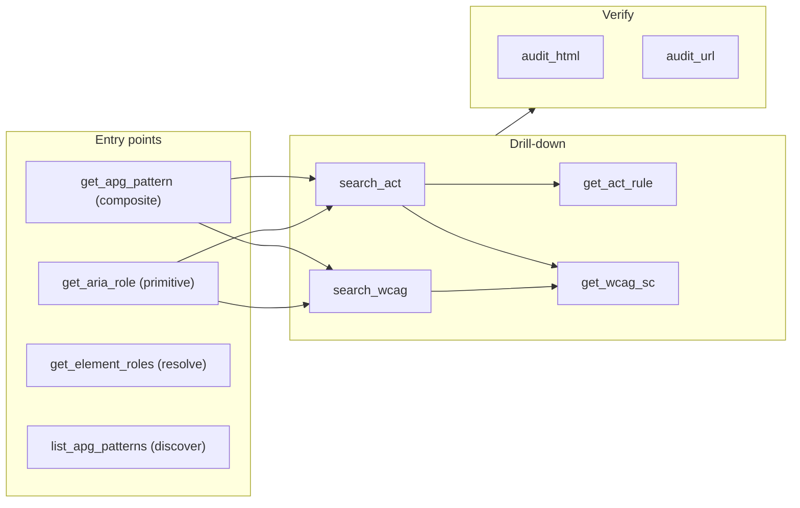

The **a11y-assist MCP server** — the agent-facing surface. It exposes the tested query packages ([`apg-query`](/a11y-assist/packages/apg-query/), [`wcag-query`](/a11y-assist/packages/wcag-query/), [`act-rules-query`](/a11y-assist/packages/act-rules-query/), `aria-query`) through scoped tools, composes them via [`a11y-assist-core`](/a11y-assist/packages/a11y-assist-core/), and runs axe-core via Playwright for verification.

It asserts nothing about "which SCs apply." Each response is verbatim data, mechanically-derived data, or a runnable next query. See [the Architecture](/a11y-assist/architecture/) for the model.

## The model: scoped entry points → shared drill-down → verify



Both entry points return the same shape (`aria_contract` + `native_elements` + `suggested_queries`; APG adds the verbatim `apg` card) and converge on the same drill-down. The `suggested_queries` seed **two paths** so the drill-down is never empty: `search_act` (ACT rules → the WCAG SCs they cover, the mechanical **ACT rule → WCAG SC** link) and `search_wcag` (WCAG criteria directly, for components ACT's text index would miss). Both land on `get_wcag_sc`.

## Tools

| Tool | Params | Purpose |
|---|---|---|
| `get_apg_pattern` | `name`, `level=AA` | Entry for composite components. Verbatim APG card + ARIA contract + native elements + `suggested_queries`. |
| `get_aria_role` | `role`, `level=AA` | Entry for native primitives. ARIA contract + native elements + `suggested_queries`. |
| `get_element_roles` | `tag`, `attrs?` | Resolve an HTML element to its implicit ARIA role(s). |
| `list_apg_patterns` | — | Discover APG pattern names. |
| `search_act` | `query`, `level=AA` | Drill-down hub. ACT rules matching `query`, each with its in-scope WCAG SC ids; suggests `get_wcag_sc` calls. |
| `get_act_rule` | `id` | Full verbatim ACT rule. |
| `search_wcag` | `query`, `level=AA` | SCs by keyword, level-gated. |
| `get_wcag_sc` | `id` | Verbatim SC + sufficient techniques + documented failures. (Not level-gated — explicit fetch.) |
| `audit_html` | `html`, `component?`, `stylesheetPath?` | Run axe against an HTML snippet. |
| `audit_url` | `url`, `component?`, `waitForSelector?` | Run axe against a live URL (catches dynamic behaviour). |

`level` is `A | AA | AAA`, cumulative (`AA` ⇒ A∪AA), default `AA`. It's set at the entry call and stamped into the `suggested_queries`, so the agent runs pre-gated drill-down.

## Workflow

```
get_apg_pattern("dialog", "AA")          # or get_aria_role("textbox","AA") for a primitive
   → suggested_queries:
        search_act("dialog"|"focus"|"keyboard", AA)
        search_wcag("dialog"|"focus"|"keyboard"|"name", AA)
search_act("focus", "AA")                # run a suggestion; the agent picks the path
   → ACT rules + their in-scope SC ids → suggests get_wcag_sc(...)
search_wcag("focus", "AA")               # or reach WCAG directly (larger corpus)
   → SC ids → get_wcag_sc(...)
get_wcag_sc("2.4.3")                      # full SC + techniques + failures
audit_html("<dialog>…</dialog>")          # verify (axe covers contrast, target size, etc.)
```

Each call returns a small payload; the agent decides which path and how far to drill.

The tool layer is thin: `search_act`, `search_wcag`, `get_wcag_sc`, `get_act_rule`, and the composition tools all delegate to [`a11y-assist-core`](/a11y-assist/packages/a11y-assist-core/), so the server and the website query the same surface.

## Install

```sh
npm install
npm run build
npx playwright install chromium   # required for audit tools (~150 MB)
```

## MCP client config

```json
{
  "mcpServers": {
    "a11y": {
      "command": "node",
      "args": ["/absolute/path/to/a11y-assist/packages/mcp/dist/server.js"]
    }
  }
}
```

## Verify

```sh
node dist/server.js < /dev/null 2>&1 | head -4
```
```
[a11y-assist-mcp] axe tags: wcag2a, wcag2aa, wcag21a, wcag21aa
[a11y-assist-mcp] tools: get_apg_pattern, get_aria_role, get_element_roles, list_apg_patterns, search_act, get_act_rule, search_wcag, get_wcag_sc, audit_html, audit_url
[a11y-assist-mcp] data: apg-query (28 patterns @ …), wcag-query (WCAG 2.2, 86 SCs), act-rules-query (94 rules @ …)
```

## Honest scope

axe catches ~50% of WCAG. A passing audit means "no automated violations found," not "accessible." ACT publishes no rules for some visual/perceptual SCs (contrast, target size, focus appearance) — those are caught by **axe at verification** and by manual review, not asserted per-pattern. Manual screen-reader, keyboard, and cognitive review remain required. See [the Architecture](/a11y-assist/architecture/).
