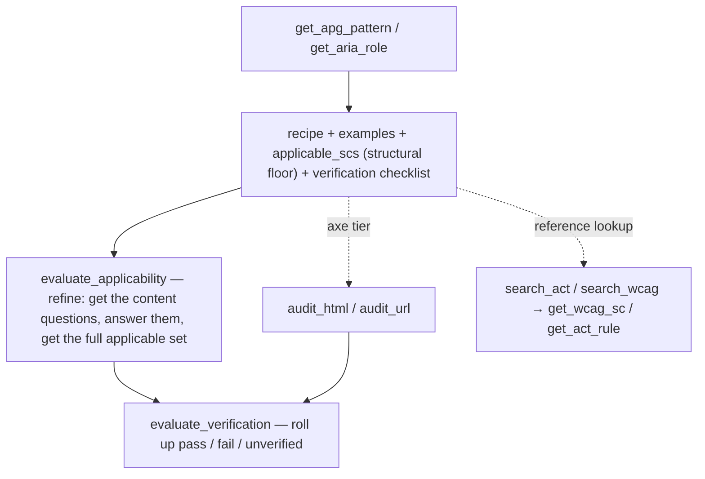

The **a11y-assist MCP server** — the agent-facing surface. It exposes the query packages and [`a11y-assist-core`](/a11y-assist/packages/a11y-assist-core/) through scoped tools and runs axe-core via Playwright. Every response is verbatim data, mechanically-derived data, the applicable criteria, or a runnable next query — **never a conformance claim**.

## The flow



You enter at a component and immediately get its **structural floor** of applicable criteria plus a checklist; you *refine* to the content-dependent rest only when you need it; you verify with axe + the checklist; and you can drill into any source directly for reference.

## Tools

| Tool | Params | Purpose |
|---|---|---|
| `get_apg_pattern` | `name`, `level=AA` | Entry for composite components. Verbatim APG card (about, keyboard, **examples**) + ARIA contract + native elements + `suggested_queries` + **`applicable_scs`** (floor + tiered checklist). |
| `get_aria_role` | `role`, `level=AA` | Entry for native primitives. ARIA contract + native elements + `suggested_queries` + `applicable_scs`. |
| `get_element_roles` | `tag`, `attrs?` | Resolve an HTML element to its implicit ARIA role(s). |
| `list_apg_patterns` | — | Discover APG pattern names. |
| `evaluate_applicability` | `pattern`\|`role`, `level`, `present?` | **Refine** beyond the floor. No `present` → the content/context questions, grouped by facet. With `present` (the predicates that hold) → the complete applicable SC set + checklist. |
| `evaluate_verification` | `scs`, `pass?`, `fail?` | Roll up the checks you resolved → per-SC `pass` / `fail` / `unverified`. |
| `search_act` | `query`, `level=AA` | ACT rules matching `query`, each with its in-scope WCAG SC ids. |
| `search_wcag` | `query`, `level=AA` | WCAG SCs by keyword, level-gated. |
| `get_act_rule` | `id` | Full verbatim ACT rule. |
| `get_wcag_sc` | `id` | Verbatim SC + sufficient techniques + documented failures (not level-gated — explicit fetch). |
| `audit_html` | `html`, `component?`, `stylesheetPath?` | Run axe against an HTML snippet. |
| `audit_url` | `url`, `component?`, `waitForSelector?` | Run axe against a live URL (catches dynamic behaviour). |

`level` is `A | AA | AAA`, cumulative (`AA` ⇒ A∪AA), default `AA`. The applicability / refine / verification tools are **experimental**.

## Workflow

```
get_apg_pattern("dialog", "AA")            # recipe + examples + applicable_scs (floor) + checklist
# …build it, studying the linked APG examples…
evaluate_applicability("dialog", "AA")     # the content/context questions for this component
evaluate_applicability("dialog", "AA", present=["non-text-content-present", …])
                                           # → the COMPLETE applicable SC set + checklist
audit_html("<dialog>…</dialog>")           # resolve the axe tier of the checklist
evaluate_verification(scs, pass=[…], fail=[…])   # → per-SC pass / fail / unverified
```

Reference lookups are independent: `search_act` / `search_wcag` → `get_wcag_sc` / `get_act_rule` answer "what does X require?" without building anything. The tool layer is thin — everything delegates to `a11y-assist-core`, so the server and the website share one engine.

## Install

```sh
claude mcp add a11y -- npx -y a11y-assist-mcp
npx playwright install chromium   # required for the audit tools (~150 MB)
```

For other MCP clients, run `npx -y a11y-assist-mcp` as the server command. See the [setup guide](/a11y-assist/agents/).

## Honest scope

axe settles only the **structurally testable** part of WCAG — a small slice, not "half." A passing audit means "no automated violations found," not "accessible." That is why the checklist is **tiered**: axe resolves what it can, the agent resolves what it can confirm by inspecting the markup, and the rest is handed to a human. An `applicable_scs` floor is "what the component's structure entails," not the complete set — `evaluate_applicability` adds the content-dependent rest. Nothing here is a conformance claim. See [the Architecture](/a11y-assist/architecture/).
